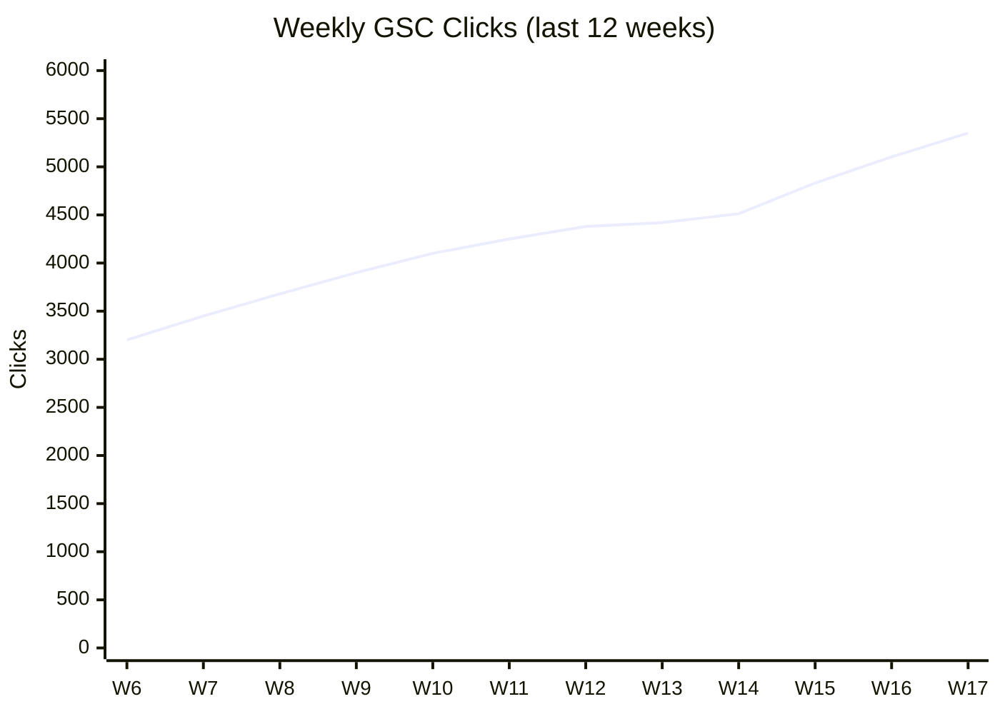

# JR Academy SEO 表现周报（关键词排名 + GSC + Web Vitals）— PRD

## 1. 背景与目标

### 1.1 为什么要做

JR Academy 现在的 SEO 监测覆盖只有两条线：

- `seo-reports/` — 每日 sitemap 4xx/5xx 健康度（**只看坏没坏**）
- `ai-visibility/` — 每周 GEO 监测（**只看 AI 引擎**）

中间这一大块——**传统 Google 排名表现 / 关键词机会 / 内容 ROI 数据**——目前**没人盯**。具体盲区：

- 哪些关键词排名跌了？跌了多少？哪一周开始跌？
- GSC 里有没有"曝光高但点击率低（标题/描述写差了）"的关键词？这是最便宜的优化机会
- 哪些页面在掉流量？为什么掉？
- Core Web Vitals（LCP / INP / CLS）哪些页面拉胯？
- 新发布的内容有没有被索引？多久被索引？

竞品（Semrush / Ahrefs）月费 $140-$249 起，**单 jiangren.com.au 一个站根本不值这钱**。但缺数据又不行。这个 PRD 自建一份够用的版本。

### 1.2 目标

每周一 9:00 Brisbane 自动产出 SEO 表现周报：

- **关键词排名**：自己 100 个核心关键词在 Google AU/CN/EN 的位置 + 周环比
- **GSC 表现**：top queries / top pages 的 clicks / impressions / CTR / position 变化
- **内容机会**：高 impression + 低 CTR 的关键词清单（标题/描述优化）
- **索引健康**：本周新提交、被索引、掉出索引的 URL
- **Core Web Vitals**：差页面 top 10 + 周环比
- **行动清单**：5-10 条按 ROI 排序的可执行项

作为：

- SEO 团队的"这周修什么"决策依据
- 内容团队的"哪些页面值得加深 / 重写"信号
- 增长团队验证"本月内容投入到底有没有带来排名/流量"

### 1.3 非目标

- ❌ 不做对手关键词排名追踪（成本 vs 价值不划算，留给 v3）
- ❌ 不做 backlink 详细分析（用 Ahrefs Webmaster Tools 免费版手查）
- ❌ 不做实时排名监测（每周快照足够，频繁查浪费 API 配额）
- ❌ 不重复 `seo-reports/` 的 4xx/5xx 扫描（那个已每日跑）
- ❌ 不重复 `ai-visibility/` 的 LLM 监测
- ❌ **不做实时排名查询页面**（API key 不能放前端，需要后端代理，本期部署模式不支持）
- ❌ **不做交互式历史仪表盘**（markdown 静态文件画不了交互图，留给 v2 在 admin 单独做）

### 1.4 部署模式与可行性评估

本报告复用现有 omni-report 部署模式：**Claude Code 远程 routine + GitHub commit + Notion MCP 同步**。无独立后端 server、无独立 cron 服务器、无数据库。所有功能必须能在这个无状态、纯 routine + 静态文件的模式下跑通。

#### ✅ 100% 可行（照搬现有 4 个 routine 的模式）

| 功能 | 实现方式 | 现有依据 |
|------|---------|---------|
| GSC 数据拉取 | routine 内 `curl` GSC API + service account JWT | GSC 是标准 REST API |
| DataForSEO SERP 排名 | routine 内 `curl` REST API | 无状态、按调用计费 |
| PageSpeed Insights | routine 内 `curl` PSI REST API | 免费 + 配额够用（参考值 25k/天，setup 时核实） |
| diff 上周数据 | 读 `seo-performance/{上周日期}.json` | 与 `seo-reports/` `competitor-reports/` 同模式 |
| markdown 报告生成 | Write 到 `seo-performance/{date}.md` | 与现有 4 个 routine 完全一致 |
| Notion 摘要同步 | Notion MCP 写 hub page | `competitor-reports/` `ai-visibility/` 已在用 |
| 告警推送（重大跌幅） | routine 内调微信/钉钉 webhook | 与 jr-wiki AI 日报 routine 同模式 |
| 历史趋势可视化 | mermaid xychart-beta（GitHub 原生渲染） | 静态、无需 JS、无需后端 |

**这部分占 PRD 范围的 ~90%，全部可以靠现有 routine 模式直接落地。**

#### ⚠️ 需要一次性 credential setup（非技术难点，是流程）

| 项 | 操作 | 责任人 | 预估时间 |
|----|------|--------|---------|
| GSC service account | GCP console 建 SA → JSON 下载 → SA email 加入 jiangren.com.au GSC 用户列表 | 站长（CEO/CTO） | 5 min |
| DataForSEO 账号 | 注册 + 充值 $20（够 2 年） | 站长 | 5 min |
| PageSpeed Insights API key | GCP console 启用 API + 创建 key | dev | 2 min |
| Routine secrets 注入 | `claude.ai/code/routines/{id}/edit` 配置环境变量：`GSC_SA_JSON_BASE64` / `DATAFORSEO_LOGIN` / `DATAFORSEO_PASSWORD` / `PSI_API_KEY` | dev | 5 min |

> ⚠️ **未验证假设**：Claude Code routine 的 secrets 长度/数量上限本 PRD 阶段没确认。GSC service account JSON 约 2-3KB，setup 时需先用 dummy secret 测试能否完整存入。如不支持长字符串，fallback：把 SA JSON base64 后存（变长 ~33%），routine 内 `echo $GSC_SA_JSON_BASE64 | base64 -d` 解码使用。

#### ❌ 现有部署模式做不了（明确不在 v1 范围）

| 想做的事 | 为什么做不了 | v2/v3 的解 |
|---------|-------------|----------|
| 实时排名查询页面（"我现在搜 X 排第几"按钮） | API key 不能放前端；需后端代理 | v2 在 `jr-academy/` NestJS 加 `/admin-cms/seo-rank` 接口；admin 调用 |
| 交互式历史仪表盘（点击关键词看曲线） | 纯 markdown 渲染不了交互；GitHub Pages 也不能跑动态查询 | v2 在 `jr-academy-admin/` 加 `/seo-performance` 页面，读 omni-report 历史 JSON 渲染图表 |
| 每小时刷新排名 | routine 最低粒度是 cron 且太频繁烧 API + 业务上无意义 | 不做 |
| 单次跑 1000+ 关键词 | routine 有 stream idle timeout（参考竞品周报分 5 phase） | PRD 5.3 已设计 4 batch × 25 关键词应对 |
| 超大历史数据累积查询（>1 年） | JSON 在 GitHub repo 累积会拖慢 clone | v3 归档老数据到 S3 + admin 页提供查询接口 |
| 跌幅突发告警（小时级） | routine 是定时跑的不是事件驱动 | v2 接入 GSC 的 webhook（如果 Google 支持）或自建 NestJS poller |

#### 历史趋势可视化（v1 用 mermaid，不依赖任何额外基建）

每份周报里嵌 4 个核心指标过去 12 周的 mermaid xychart-beta 折线图（GitHub README 原生渲染）：

- 总曝光（impressions）
- 总点击（clicks）
- 平均位置（avg position，Y 轴反向）
- Top 10 关键词数



够用、零部署成本。当 omni-report 累积 ≥12 周数据后，再决定是否值得做 v2 交互式 dashboard。

---

## 2. 数据源

| 源 | 用途 | 成本 | 备注 |
|----|------|------|------|
| **Google Search Console API** | 自己站排名/曝光/点击/CTR 真实数据 | 免费 | 真实用户看到的位置，最权威 |
| **DataForSEO SERP API** | 100 个核心关键词在 SERP 的位置（含未在 GSC 出现的） | ~$0.06/100 关键词 | 补 GSC 的盲区（排名 11+ 的关键词 GSC 不显示 position） |
| **PageSpeed Insights API** | Core Web Vitals（LCP/INP/CLS） | 免费 | 每天 25k 配额，单站够用 100 倍 |
| **GSC URL Inspection API** | 单页索引状态（是否被索引、最后爬取时间） | 免费 | 配额 2000/天 |

**总成本**：每周 100 关键词 × DataForSEO ≈ **$0.24/月**。其它全免费。

> ⚠️ DataForSEO 账号 + GSC OAuth credential 用 `omni-report/.env`（gitignored），routine 通过 `process.env` 注入。setup 单独写在 `scripts/seo-performance/SETUP.md`。

---

## 3. 100 个核心关键词清单（v1）

按 4 类分组，**Agent 不要自己改这个清单**，需人工维护（每季度 review 一次）。

### A. 品牌词（10 个）
"jr academy" / "匠人学院" / "匠人学院 怎么样" / "jr academy 评价" / "jr academy bootcamp" / "jiangren academy" / "匠人学院 课程" / "匠人 求职" / "匠人 ai" / "JR 学院"

### B. 核心课程主题（30 个）
分布到：AI Bootcamp / AI Engineer / Vibe Coding / Prompt Master / AI Builder / AI PM / Context Engineering / Lab 类（前端/Python/AWS/Azure/LLM）/ 求职辅导 / 留学。

具体清单见 `scripts/seo-performance/keywords.json`，**首批由 Claude 从 GSC top 1000 queries 抽取**（impressions DESC + 业务相关 filter），人工 review 后落库。

### C. 长尾内容词（30 个）
博客/wiki/cheatsheet 命中的关键词。如 "claude code mcp 教程"、"cursor vs claude code"、"AI Engineer 路线图 2026"。

### D. 求职 / 转行词（30 个）
如 "AI Engineer 转行"、"留学生回国 AI 求职"、"产品经理学 AI"、"前端转 AI Engineer"。

**地理 + 语言切片**：每个关键词跑 3 个 location（AU 英文 / AU 中文 / CN 中文）= 100 × 3 = 300 次 API 调用 ≈ $0.18/周 = $0.72/月。

---

## 4. 输出规范

### 4.1 文件路径

```
seo-performance/{YYYY-MM-DD}.md
seo-performance/{YYYY-MM-DD}.json   # 结构化数据，给后续 routine 复用
```

### 4.2 Markdown 结构

```markdown
# SEO 表现周报 YYYY-MM-DD

> GSC 数据范围：YYYY-MM-DD ~ YYYY-MM-DD（最近 7 天）
> SERP 抓取时间：YYYY-MM-DD HH:mm AEST
> 总扫描关键词：300（100 关键词 × 3 location）

## 📊 总览仪表盘

| 指标 | 本周 | 上周 | 周环比 |
|------|------|------|--------|
| GSC 总曝光 | 125,432 | 118,200 | +6.1% ✅ |
| GSC 总点击 | 4,832 | 4,512 | +7.1% ✅ |
| 平均 CTR | 3.85% | 3.81% | +0.04pp |
| 平均位置 | 18.2 | 19.5 | -1.3 ✅ |
| Top 10 关键词数 | 47 | 41 | +6 ✅ |
| 已索引页面 | 1,289 | 1,247 | +42 ✅ |
| Core Web Vitals 良好率 | 78% | 76% | +2pp |

## 🔴 排名跌幅 TOP 10（本周重点）

| 关键词 | 上周位置 | 本周位置 | 变化 | 着陆页 | 可能原因 |
|--------|---------|---------|------|--------|----------|
| AI bootcamp 澳洲 | 8 | 15 | -7 | /bootcamp/ai-essentials | 页面无变化，需查竞品是否更新 |
| prompt engineer 课程 | 5 | 12 | -7 | /learn/prompt-master | 上周改过 H1，可能影响 |

## 🟢 排名涨幅 TOP 10（保持）

| 关键词 | 上周位置 | 本周位置 | 变化 | 着陆页 |
|--------|---------|---------|------|--------|
| vibe coding 学习 | 18 | 7 | +11 | /learn/vibe-coding/hub |

## 💎 内容机会（高 impression + 低 CTR）

GSC 数据 — 曝光 > 500 但 CTR < 1%，**改 title + meta description 立刻见效**：

| 关键词 | 曝光 | 点击 | CTR | 平均位置 | 着陆页 | 建议 |
|--------|------|------|-----|---------|--------|------|
| AI 课程推荐 | 1,247 | 4 | 0.32% | 8.3 | /learn | title 没带"推荐"关键词 |
| 求职匠 chrome | 832 | 5 | 0.60% | 6.1 | /tools/job-hunter | meta description 太长被截断 |

## 📈 流量增长 TOP 5 页面

| 页面 | 本周点击 | 上周点击 | 变化 |
|------|---------|---------|------|
| /blog/claude-code-mcp-tutorial | 423 | 12 | +3425% 🚀 |

## 📉 流量下跌 TOP 5 页面（重点排查）

| 页面 | 本周点击 | 上周点击 | 变化 | 排查方向 |
|------|---------|---------|------|----------|
| /learn/ai-engineer/hub | 89 | 234 | -62% | 是否最近改过？是否 404？是否被竞品超越？ |

## 🆕 索引变化

- ✅ 本周新被索引：18 个 URL（list 见 JSON）
- ⚠️ 本周掉出索引：3 个 URL（重点查）
  - `/blog/some-old-post` — 可能内容太薄被 Google 过滤
- ⏳ 提交但未索引（>14 天）：12 个 URL

## ⚡ Core Web Vitals 差页面 TOP 10

| 页面 | LCP | INP | CLS | 主要问题 |
|------|-----|-----|-----|----------|
| /bootcamp/ai-essentials | 4.2s 🔴 | 180ms ⚠️ | 0.05 ✅ | 大图未优化 |

## 🎯 推荐行动清单（按 ROI 排序）

| # | 行动 | 修复哪个问题 | 预估工作量 | 预估 ROI |
|---|------|------------|-----------|---------|
| 1 | 改 /learn 页 title 加"推荐"关键词 | "AI 课程推荐" CTR 0.32% | 5min | 月增 200+ 点击 |
| 2 | 调查 /learn/ai-engineer/hub 流量跌 62% 原因 | 流量异常 | 30min | 救回 100+ 周点击 |
| 3 | 优化 /bootcamp/ai-essentials 首屏图片 | LCP 4.2s | 1h | 排名+CWV 双重收益 |

## 📋 上周行动项 verify

| 上周行动 | 状态 | 数据验证 |
|---------|------|---------|
| 重写 /learn meta description | ✅ 完成 | "AI 学习平台" CTR 0.8% → 2.1% ✅ |
| 修复 /blog/xxx 的 LCP | ❌ 未完成 | LCP 仍 5.1s |

## 附录：完整数据

完整 300 关键词排名 / GSC top 1000 queries / 索引状态详见同名 `.json` 文件。
```

### 4.3 反 AI 味格式（硬规则）

- 禁止 "整体表现良好" / "需要持续优化" / "值得关注" 等空话
- 每条数据必须有具体数字 + 关键词 + 着陆页 URL
- 每条建议必须可执行（"改 title 为 X"，不是"优化标题"）
- "可能原因"必须是具体假设（"竞品更新了内容"、"上周改过 H1"），不是"多种因素"

---

## 5. 技术方案

### 5.1 配置

| 项 | 值 |
|----|----|
| Routine name | `JR SEO Performance Weekly` |
| Cron | `0 23 * * 0` UTC = **周一 9am Brisbane** |
| Repo | `https://github.com/JR-Academy-AI/omni-report` |
| Model | `claude-sonnet-4-6` |
| Tools | Bash / Read / Write / Edit / WebFetch |
| Secrets | `DATAFORSEO_LOGIN` / `DATAFORSEO_PASSWORD` / `GSC_SERVICE_ACCOUNT_JSON` / `PSI_API_KEY` |

### 5.2 脚本结构

```
scripts/seo-performance/
├── SETUP.md                  # GSC OAuth + DataForSEO 账号配置
├── keywords.json             # 100 个核心关键词 × 3 location 矩阵
├── fetch-gsc.ts              # 拉 GSC search analytics + index coverage
├── fetch-serp.ts             # 调 DataForSEO 抓 SERP 排名
├── fetch-cwv.ts              # 调 PageSpeed Insights API
├── analyze.ts                # diff 上周 + 找 opportunity + ROI 排序
├── render-report.ts          # 生成 markdown
└── run.ts                    # 主入口
```

本地手跑：

```bash
bun run scripts/seo-performance/run.ts                # 用今天 AEST 日期
bun run scripts/seo-performance/run.ts 2026-04-29     # 指定日期
```

### 5.3 Phase 设计（防 stream idle timeout）

300 次 SERP 调用 + GSC + CWV + diff 计算，时间不短。必须分批 commit：

- **Phase 0**：读 PRD + 读上周报告（拿到上周数据 baseline）
- **Phase 1**：拉 GSC 数据 → 写 `{date}.json` 骨架 + commit
- **Phase 2**：拉 SERP 排名（4 batch × 25 关键词）→ 每 batch 完写入 JSON + commit
- **Phase 3**：拉 CWV + 索引状态 → 合并 JSON + commit
- **Phase 4**：diff 上周 + 生成 markdown 报告 + commit
- **Phase 5**：Notion hub page 同步极简摘要

每 Phase 完成立即 `git push`（参考竞品周报防静默挂规则）。

### 5.4 错误处理

- DataForSEO 失败：跳过 SERP 部分，报告里标 "⚠️ SERP 数据本周缺失"
- GSC 失败：致命，停止 routine（GSC 是核心数据源）
- PSI 失败：跳过 CWV 部分，标 "⚠️ CWV 数据本周缺失"
- 单关键词失败：记入 errors.json，不阻塞整体

---

## 6. 验收标准

第一份必须满足：

- [ ] 路径正确：`seo-performance/YYYY-MM-DD.md` + `.json`
- [ ] GSC 数据完整（曝光 / 点击 / CTR / position 4 个核心维度）
- [ ] 100 关键词 × 3 location SERP 数据完整（缺失率 < 5%）
- [ ] CWV 至少覆盖 top 50 流量页面
- [ ] 总览仪表盘 7 个核心指标 + 周环比
- [ ] 排名跌幅/涨幅各 top 10
- [ ] 内容机会清单 ≥ 5 条（可执行）
- [ ] 行动清单 ≥ 5 条按 ROI 排序
- [ ] 第二周起：上周行动项 verify 部分非空
- [ ] 0 条 AI 味开场
- [ ] git push + Notion 双轨

---

## 7. Roadmap

| 版本 | 范围 | 部署增量 | 时间 |
|------|------|---------|------|
| **v1（本期）** | GSC + DataForSEO + PSI 三源 + 自己 100 关键词 + 周环比 + mermaid 历史折线 | 纯 routine + GitHub commit，无任何后端 | 现在做 |
| **v2a** | 加月环比 + 季度环比；CWV 历史曲线累积 | 仍纯 routine，只加报告维度 | 跑 4 周后 |
| **v2b** | `jr-academy-admin/seo-performance` 交互式仪表盘（读 omni-report JSON） | **首次需要后端**：admin 增页 + NestJS 加 `/admin-cms/seo-performance/list` 读 GitHub raw JSON 接口 | 累积 12 周数据后 |
| **v2c** | 实时排名查询接口（admin 输入关键词→后端代理 DataForSEO） | 复用 v2b 后端，加 `/admin-cms/seo-rank/query` | 与 v2b 同期 |
| **v3** | 加对手 5 个站的关键词排名（合并入本报告） | 仍纯 routine | 2026-Q3 |
| **v4** | 接 Ahrefs API（如果预算允许）做 backlink 监测；老数据归档到 S3 | 视情况加 S3 + admin | 2026-Q4 |

**关键边界**：v1/v2a/v3/v4 全部都是纯 routine，唯一一次"破出无后端模式"是 v2b/v2c 引入 admin 页 —— 那时已积累足够数据证明值得投入后端工时。

---

## 8. 与其他 routine 关系

```
        SEO Healthcheck (每日 6am)         ──→ 提供 4xx/5xx 候选给本报告 "索引变化" 节
                                                    │
        SEO Performance Weekly (周一 9am)  ──┐      │
                                              ↓     ↓
        AI Visibility Weekly (周三 9am)    ──→ 内容/SEO 团队执行
                                              ↑
        Competitor Weekly (周日 8pm)       ───┘
```

**核心复用**：
- 引用 `seo-reports/{date}.md` 的坏 URL 列表，标记"已被识别为 4xx 但仍在索引"的页面
- 给 `ai-visibility/` 提供"哪些 query 在 Google 排名好但 AI 不提"的 cross check 信号
- 给 `marketing-topics/` 提供"哪些长尾词曝光增长快"的内容选题信号
- 给 `daily-assignments/` 提供"本周 SEO 修复"的 todo 池

---

## 9. 与 Semrush 的功能对比

| Semrush 功能 | 本报告覆盖 | 备注 |
|-------------|-----------|------|
| Position Tracking | ✅ | 100 关键词 × 3 location |
| Site Audit | ✅ | 复用 `seo-reports/` |
| Keyword Magic Tool | ⚠️ 部分 | 用 GSC top queries + DataForSEO 关键词 API（v2 加） |
| Backlink Analytics | ❌ | 用 Ahrefs Webmaster Tools 免费版手查 |
| Traffic Analytics（对手） | ❌ | 不做，留给 v3 |
| **AI Visibility（Semrush 新功能）** | ✅ | 已由 `ai-visibility/` 覆盖 |

**月成本对比**：Semrush Pro $140/月 vs 本方案 $0.72/月。

---

## 附录 A：相关文档

- `PRD_AI_VISIBILITY.md` — GEO 监测 PRD（互补方）
- `PRD_COMPETITOR_WEEKLY.md` — 竞品周报 PRD（v3 关键词追踪复用其域名清单）
- `seo-reports/` — 每日 sitemap 健康度（数据互通）
- `https://claude.ai/code/routines` — Routine 控制台
