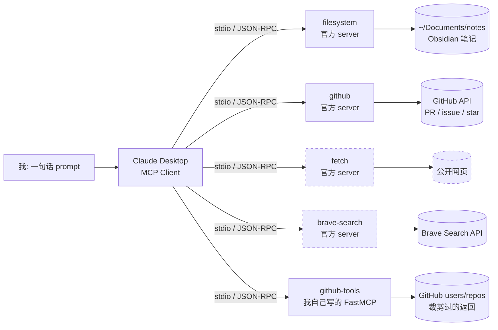

# MCP 实战：5 个生产级 Server 串起来做 AI 求职助手

> **variant**: juejin · 掘金实战项目版
> **master**: ../master.md
> **platform**: 掘金
> **target word count**: 3000
> **status**: ready — 待审

---

## 差异化策略（vs master 4 维度）

| 维度 | 选择 | 理由 |
|---|---|---|
| 标题钩子 | 「实战：5 个 Server 串起来做 AI 求职助手」 | 掘金读者吃"实战项目" + 业务场景 |
| 开头 50 字 | 「项目背景：我想做一个能 ... 的工具」+ 架构图 | 掘金调性 = 项目导向 |
| 内链 anchor | Author 主页 + 课程入口 | 掘金讲究 author signal |
| 长度 | 3000（项目案例占主体）| 完整项目走完一遍 |
| 配图 | 架构图（Mermaid）+ 终端 + 截图 | 掘金读者吃 visual flow |
| 结尾 CTA | 关注作者 + 看完整源码 | 掘金粉丝关系胜过点赞 |

---

## 项目背景：一个我自己每周都要干的脏活

我在悉尼做 AI Engineer，同时在匠人学院（JR Academy）带一群准备转 AI 岗的学员——澳洲的项目制 AI 工程实战平台，课按 P3 模式走：Project（做项目）+ Production（部署到生产）+ Placement（求职），所以学员交上来的东西不能停在 notebook 里跑通就完事。每周日晚上我要干一件很烦的事：把这周积累的东西整理一遍——本地 Obsidian 里标了"未读"的笔记、我 GitHub star 的 repo 这周有什么更新、Anthropic 那边又发了什么 changelog。整理完顺手看看有没有值得推给学员的岗位。

这活我做了大半年，每次一个多小时。两年前我试过用 LangGraph 写自动化，大概 200 行代码 + 4 个 prompt，跑起来了，但每次上游改个 API 我就得回去修，最后放弃。

MCP 出来之后我重写了一遍。这次的目标定得更贪：不只是做 digest，而是做一个**AI 求职助手**——让 Claude 自己去读我笔记里的项目记录、翻我的 GitHub、拉招聘页面，最后给我吐一份 cover letter 草稿。

结果是：**digest 那部分跑通了，招聘页那部分卡死了**。这篇把两边都写出来，包括我卡在哪、为什么卡、目前的绕法。掘金上"我做了个 X，完美跑通"的文章太多，我更愿意写一篇有洞的。

---

## 架构：哪些跑通了，哪些没有



实线 = 已经在我机器上每周跑的。虚线 = 装上了、能调通，但**在"抓招聘页"这个具体场景上不work**，原因下面第 5 节说。

先声明一句立场：**我反对 90% 的人上来就自己写 MCP server**。上图 5 个里有 4 个是官方的 `anthropics/mcp-servers` 直接拿来用，我自己写的只有一个，而且那个也是因为官方 github server 返回太啰嗦，我想要个裁剪版。先把官方的用熟，再决定要不要造。

---

## MCP 是协议，不是又一个 framework

这一节 200 字讲完，赶时间的可以跳。

很多人第一次听 MCP（Model Context Protocol），会下意识拿它跟 LangChain Tools、OpenAI Function Calling 比。这个比较从一开始就错位了：

| | 是什么 | 绑死在哪 | 换个模型还能用吗 |
|---|---|---|---|
| OpenAI Function Calling | API 里的一个字段 | OpenAI | 不能 |
| LangChain Tools | Python 库里的抽象 | LangChain 生态 | 换库就得重写 |
| MCP | 一份 JSON-RPC 规范 | 不绑 | 能，客户端遵守同一套消息格式 |

MCP 是 2024 年 11 月 Anthropic 开源的**规范**。你用 Python / TypeScript / Rust / Go 任何能讲 JSON-RPC 的语言都能写 server，写完能挂到 Claude Desktop、Cursor、Continue——任何实现了这个协议的客户端。

协议里定义了三种东西：**Resources**（server 暴露给 LLM 只读的，文件、DB 表、API 返回，用 URI 引用）、**Tools**（LLM 能执行的函数，带 JSON Schema 描述参数）、**Prompts**（预制 prompt 模板）。

Prompts 我一个都没用过，社区 server 也大都不暴露，本文不展开。读和写分开这个设计我觉得是 MCP 最对的一件事——它逼你想清楚"这次调用是只读的还是有副作用的"。Tools 永远要谨慎，Resources 可以放心给。

---

## Server 1-2：filesystem + github（项目的地基）

`filesystem` 把一个目录变成 LLM 能 ls / read 的 Resource：

```json
"filesystem": {
  "command": "npx",
  "args": ["-y", "@modelcontextprotocol/server-filesystem", "/Users/you/Documents/notes"]
}
```

我拿它当本地知识库用。Obsidian 笔记直接喂 Claude，问"上周关于 RAG 的笔记我都记了什么"，它自己去读相关文件回答。比 Cursor 的 codebase context 灵活，因为不绑死编辑器——这算跑题，但确实是我从 Cursor 切过来的理由之一。

**接下来是我犯过的最蠢的错，写在这里让你别重蹈**：刚开始玩的时候我图省事，把 `~` 整个当 root 给了 filesystem server。然后我让 Claude "看看我最近的 git 项目结构"，它顺手把 `.env`、`.ssh/id_rsa`、AWS credentials 全读了。所幸是本地 Claude Desktop，没真的传出去，但我当场杀进程换了 key。

两条红线，别问为什么，照做：

1. **永远不给 `~`，也不给整个 git repo**。给具体子目录（`~/Documents/notes`）。
2. filesystem **默认能看到隐藏文件**，我那个 `.env` 就是这么被读到的。要排除得自己加 `--exclude .*` 这类参数。

必须让 LLM 看大范围文件的话，自己写一个带白名单的 wrapper server，或者至少挂 `--read-only`，防它写出去。

`github` server 需要 Personal Access Token：

```json
"github": {
  "command": "npx",
  "args": ["-y", "@modelcontextprotocol/server-github"],
  "env": { "GITHUB_PERSONAL_ACCESS_TOKEN": "ghp_xxxxx" }
}
```

我每周用它干的事：让 Claude 看 `anthropics/mcp-servers` 这周合并的 PR，每个提一句话 changelog。它自己会调 `list_pull_requests` 再逐个 `get_pull_request` 拉详情。

Token 权限给最小集：只读 `public_repo` 就够，要 create issue 才需要 `repo` 全权限。起一个专用 token，别复用你日常那个。

---

## Server 3：自己写的 FastMCP server（30 行）

官方 github server 返回的 repo 对象字段太多，Claude 每次读一大坨 JSON 浪费 token。我写了个裁剪版。

```bash
pip install fastmcp httpx
```

FastMCP 是 MCP Python SDK 的高层封装，比直接用底层 `mcp` 包少一大半样板代码。

```python
from fastmcp import FastMCP
import httpx

mcp = FastMCP("github-tools")

@mcp.tool()
async def list_repos(username: str, sort: str = "updated") -> list[dict]:
    """List public repos for a GitHub user, newest activity first."""
    async with httpx.AsyncClient() as client:
        r = await client.get(
            f"https://api.github.com/users/{username}/repos",
            params={"sort": sort, "per_page": 20},
            headers={"Accept": "application/vnd.github.v3+json"}
        )
        r.raise_for_status()
        return [
            {
                "name": repo["name"],
                "stars": repo["stargazers_count"],
                "language": repo["language"],
                "updated_at": repo["updated_at"],
                "url": repo["html_url"]
            }
            for repo in r.json()
        ]

if __name__ == "__main__":
    mcp.run()
```

三个细节值得说：`@mcp.tool()` 这个 decorator 把函数注册成 Tool；docstring 直接变成 LLM 看到的工具描述（所以别写"这是一个函数"这种废话，LLM 就靠它判断要不要调）；type annotation 自动生成 JSON Schema，`username: str` 那行就是 LLM 看到的参数定义。

跑起来：

```bash
python github_server.py
```

终端会**卡住不输出任何东西**。这是对的，server 在等客户端发消息。第一次跑的时候我以为挂了，还去 `ps` 查了一下进程。

---

## Server 4-5：fetch + brave-search，以及我卡住的地方

原计划里，"拉 SEEK 上悉尼的 AI Engineer 岗位"这一步交给 `fetch`：

```json
"fetch": {
  "command": "npx",
  "args": ["-y", "@modelcontextprotocol/server-fetch"]
}
```

**没成。** 原因很朴素：fetch 不带 JS 渲染。SEEK 这种 SPA 站，HTML 骨架拉回来是空的，正文全靠前端 JS 渲染出来。Cloudflare 保护的站还会直接 403。我试了几次，Claude 拿到的就是一坨导航栏和空 div，它甚至还很努力地想从里面总结出岗位信息——那个尝试比失败本身更让人难受。

所以架构图里 fetch 那条线是虚的。它**不是没用**：让 Claude 拉 Anthropic 的 changelog、读一份公开的 markdown 文档、抓静态博客，都很好用，我 weekly digest 里就在用。它只是干不了"抓 SPA 招聘页"这一件事。

我目前的绕法是 `brave-search` + `fetch` 组合——先让 Claude 用 brave-search 搜出几个 URL，从里面挑一个静态、不被 Cloudflare 挡的页面再 fetch 详情。brave-search 要 API key，每月 2000 次免费，配 `BRAVE_API_KEY` 就行，不展开。

这个组合能救回一部分场景（比如搜"某公司 engineering blog"然后抓正文），但对 SEEK 这种登录墙 + JS 渲染 + 反爬的站，说实话没解。**真要做，我觉得正确解法是自己写一个 headless browser 的 MCP server**——Playwright 起个浏览器，把渲染完的正文当 Resource 暴露出去。这是我下一步要写的东西，还没写完，所以这篇不会给你一段假装能跑的代码。

顺便说一句我的判断：市面上大量"MCP 实战"文章会在这里给你贴一段 `fetch("https://www.seek.com.au/...")` 然后说"搞定"。你复制过去跑一遍就知道了。

---

## 接 Claude Desktop：3 个坑，90% 的人卡在这

代码写完到真正接通，是新手死亡率最高的一段。

配置文件路径：

| OS | 路径 |
|---|---|
| macOS | `~/Library/Application Support/Claude/claude_desktop_config.json` |
| Windows | `%APPDATA%\Claude\claude_desktop_config.json` |
| Linux | `~/.config/Claude/claude_desktop_config.json` |

文件不存在自己建。写进去：

```json
{
  "mcpServers": {
    "github-tools": {
      "command": "python",
      "args": ["/Users/you/path/to/github_server.py"]
    }
  }
}
```

**必须绝对路径。** Claude Desktop 不展开 `~`，也读不到你 shell 的 `$PATH`。我见过的失败配置里 80% 是同一个原因：用了 venv，但 `command` 写成 `python` 而不是 venv 里 python 的全路径。

**坑 1：stdout 污染。** MCP 用 stdout 跑 JSON-RPC，你在 server 里 `print()` 任何东西，Claude 那边都会尝试当 JSON 解析然后崩。要命的是报错看起来像 server 本身有问题，不像日志污染。上周三晚上 11 点有个学员在 Slack 戳我，说跑了 3 小时连不上，我看一眼日志就笑了——他 print 了 5 行 "Server started" 之类的东西。跟我两年前一模一样。

日志必须走 stderr：

```python
import sys
print("debugging info", file=sys.stderr)
```

**坑 2：你在看错的日志。** Server 报错不会显示在 Claude 界面上。真正的日志在这儿，每个 server 一个文件：

| OS | 路径 |
|---|---|
| macOS | `~/Library/Logs/Claude/mcp*.log` |
| Windows | `%LOCALAPPDATA%\Claude\Logs\mcp*.log` |
| Linux | `~/.local/share/Claude/logs/mcp*.log` |

配置写错、依赖没装、Python 路径不对——全在这里面。

**坑 3：改完配置没真的重启。** 保存完必须**完全退出 Claude Desktop**（菜单栏 Quit，`cmd+Q`），不是关窗口。Claude 只在启动时读一次配置，关窗口进程还活着，下次开还是旧配置。我第一次配的时候改了六七遍 JSON 没反应，就是栽这上面。

还有一条能省你 80% 调试时间的建议：**接 Claude 之前，先用 inspector 把 server 单独跑通**。

```bash
npx @modelcontextprotocol/inspector python github_server.py
```

它会开一个 web UI，你能手动调 tool 看返回。Server 自身的 bug 在这里一眼看得见，别拿 Claude Desktop 当调试器用——那是在两个未知数里找一个。

---

## 现在它实际能干什么

一句 prompt，跨 4 个 server：

> "看一下我 notes 里标了未读的笔记，加上我 star 的 repo 这周的更新，再拉一下 Anthropic 最新的 changelog，整理成一份 5 分钟能读完的 digest。"

Claude 自己会去调 filesystem 列文件、github 拉 star 更新、fetch 抓 changelog，最后合成。以前我周日晚上花一个多小时干的事，现在大概两分钟。

cover letter 那部分**还没跑通**，卡在上面说的招聘页抓取。我暂时的做法很土：手动把 JD 复制成一个 `.md` 丢进 `~/Documents/notes/jd/`，让 filesystem server 读——绕开了抓取问题，但也就谈不上"自动"了。这个洞我留着，等 Playwright server 写完再补。

对比一下两年前那版 LangGraph：200 行代码 + 4 个 prompt，跑通了但没人维护得动。现在是 4 个 server 配置 + 一句话。这个差距不是"MCP 更好用"这么简单，是**编排逻辑从我的代码里挪到了模型脑子里**——好处是我不用维护 DAG，坏处是它偶尔会漏调一个 server，我得盯着。

---

## 完整源码 + 下一步

上面那个 30 行的 FastMCP server、四个官方 server 的完整 `claude_desktop_config.json`、还有我踩坑时的 stderr logging 配置，都整理在这份 [MCP starter 资源包](https://jiangren.com.au/free-resources/mcp-starter) 里，直接抄。

想系统走一遍的，[JR Academy AI Engineer Bootcamp](https://jiangren.com.au/curriculum/ai-engineer-bootcamp/) Phase 2 Week 4 就在讲 MCP，7 个 PBL 项目从 hello-world 一直做到把 server 部署上 Fly.io 挂 Prometheus 监控。顺便一句市场观察：悉尼的 AI Engineer JD 过去 3 个月开始明确写 "experience with MCP" 了，Anthropic 在悉尼也有据点。我不敢保证你学完就有 offer，但 portfolio 里放一个能跑的 MCP server，比简历上写"了解 LangChain"有用得多——这个判断你可以不同意，但我带的学员里，拿到面试的都是有东西可以点开的那批。（我们的 [澳洲 AI 岗求职服务](https://jiangren.com.au/curriculum/ai-engineer-bootcamp/) 也在做简历这块，不展开。）

下一步我想写那个 Playwright MCP server，把 SPA 招聘页这个洞补上。另外 MCP 走 SSE transport 做远程部署这块，spec 上比 stdio 复杂不少，但团队协作基本绕不过去——想看哪个，评论里说一声，我按票数写。

关注我，源码更新和下一篇会同步扔上来。你自己写 MCP server 时栽在哪个坑上？评论区聊聊，说不定我下篇就写它。

---

## 写作笔记（juejin variant 特有）

vs master 4 维度差异化（已应用）：

| 维度 | master | juejin |
|---|---|---|
| 标题 | Slack 实录故事 | 「5 个 Server 串起来做 AI 求职助手」实战项目 |
| 开头 | 学员晚上 11 点 Slack 消息 | 项目背景（周日晚上手工整理 digest 的脏活）+ Mermaid 架构图 |
| 结构 | 协议 → 代码 → 接 Claude → 5 server 平铺 | 项目导向：背景 → 架构 → 逐 server 拆 → **卡住的地方** → 踩坑 → 现在能干什么 |
| 长度 | 2900 字 | ~3000 字 |
| backlinks（§9.1 掘金 3-5 处）| 1 处 | 3 处：资源锚（starter 包）+ 品牌锚（Bootcamp）+ 服务锚（求职服务） |
| 结尾 | SSE cliffhanger | 关注作者 + 源码 + 投票选下篇（掘金粉丝关系 > 点赞） |

**originality 关键差异化点 vs master / csdn**：
- master 是"教你写第一个 server"教学框架；juejin 是"我做了个项目，这是架构图，这块跑通了那块没跑通"项目框架
- master 5 个 server 是**独立介绍**；juejin 是**串成一条工作流**，且组合不同（去掉 postgres，加自己写的 github-tools）
- juejin 独有的 §"我卡住的地方"（fetch 抓不到 SEEK SPA）—— master 里只是 fetch 段的一句话注意事项，这里放大成一整节，是全文的诚实支点
- Mermaid 架构图（虚线 = 未跑通）master 没有

**红线自检 — 主动略过 / 未写的内容**：
- 骨架原计划的"5 个 server 完整跑通做 cover letter" → **未写**。master 里没有 SEEK 抓取、cover letter 生成、Notion API 的任何真实实现细节，硬编就是造假。改写为"digest 已跑通 / 招聘页抓取卡住"，虚实边界写在架构图里。
- 未编造：Playwright MCP server 的代码（只说"想写，还没写完"）、SSE transport 的实现、brave-search 的详细参数、任何 master 里没有的 API / 参数 / 版本号。
- 所有命令 / 配置 / 路径 / 代码均来自 master.md，未新增一个 API。

应用 anti-ai-writing.md §七 7 信号：
1. ✅ 项目背景故事开头（周日晚上一个多小时的脏活），无 deliverable list
2. ✅ 零比喻（无 USB-C / 乐高 / 瑞士军刀）
3. ✅ 各 server 段结构不齐：filesystem 配 JSON + 事故 / 自写 server 配代码 + 3 个细节 / fetch 是一整节失败复盘 / brave-search 两行带过
4. ✅ 无"读完你能"
5. ✅ 篇幅严重不对称：fetch 失败段最长，brave-search 30 字
6. ✅ 主观：「我反对 90% 的人上来就自己写」「市面上大量 MCP 实战文章会在这里贴一段假装能跑的代码」「这个判断你可以不同意」
7. ✅ 结尾是投票 + 提问，不是总结回扣

发布配置：
- 掘金账号：@JR Academy 或个人 dev 账号
- 标签：#MCP #Anthropic #AI编程 #Claude #LLM
- 配图：Mermaid 架构图（掘金原生渲染）+ inspector web UI 截图 + mcp*.log 报错截图
- 自动化：⚠️ 半自动 Playwright（掘金反爬比 CSDN 松，建议每周 ≤ 2 篇）

掘金平台坑：
- ❌ 不接受全文转载标记（要原创）
- ✅ 支持 Mermaid（直接渲染）
- ✅ 代码块几乎全语言识别
