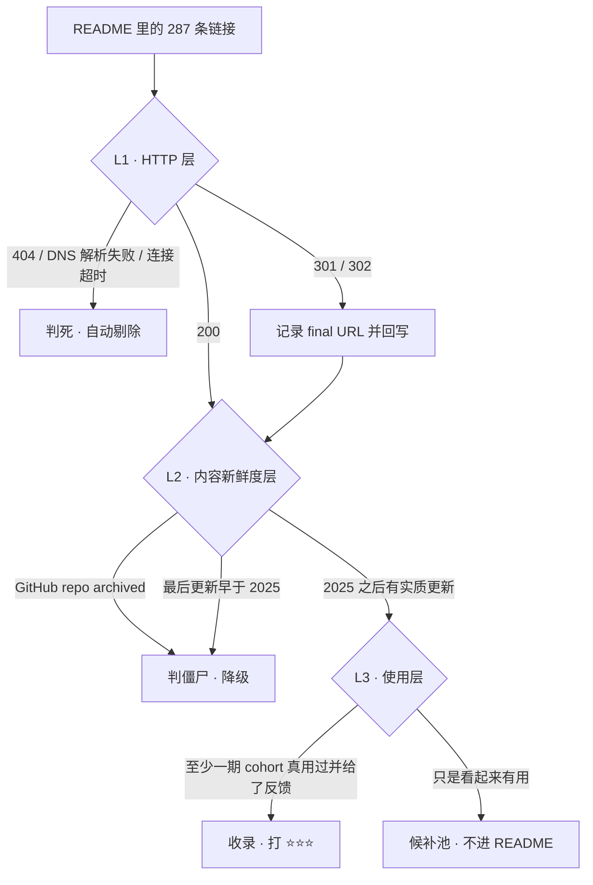
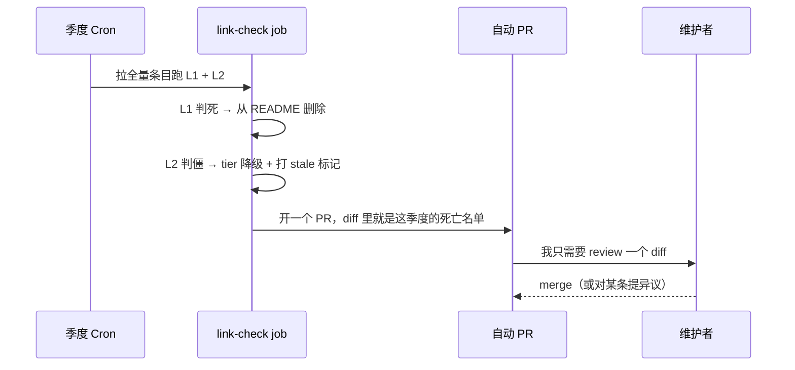

<!--
掘金发布前手填：
  - 分类：AI（备选：架构）
  - 标签（3-5 个）：人工智能 / GitHub / 开源 / 架构 / 前端后端通用
  - 原创/转载：**原创（必勾）** —— 掘金红线，不勾直接降推荐
  - 专栏：新建「AI 工程实战笔记」或挂已有专栏
  - 封面图：横版 —— 建议「三层判活流水线」Mermaid 图导出 PNG（不要用老 repo 截图，那是知乎/公众号版的封面，重复会被识别成同稿多发）
  - 发布节奏：掘金一周 ≤ 2 篇，本篇发出后 3 天内不要再发同话题
  - 掘金调性：项目实战 > 故事。架构图先行，选型表要有维度，踩坑段要有具体报错/具体判断
-->

## 差异化策略（发布前删掉这一块）

| 维度 | 本篇（掘金） | 已有变体怎么写的 | 怎么错开 |
|---|---|---|---|
| **框架** | **项目实战**：把「链接体检」做成一条三层判活 + 准入规则的流水线，讲架构和选型 | 知乎=自黑暴论故事 / 公众号=情绪叙事 + 排版 / HN=Show HN 克制英文 / CSDN=代码密集 + 报错现场 | 掘金唯一一篇有 Mermaid 架构图 + 选型维度表 + 规则 schema 的 |
| **标题钩子** | 「73% 死链」→ 工程问题（怎么判一条链接是不是真活着） | 知乎「我自己 3 年没看了」/ 公众号「刚翻出来吓到了」/ HN「After 9 years, 80% was dead」 | 不打情绪牌，打工程牌 |
| **开头** | 从「脚本给了我一份错误的报告」切入，5 行讲完背景 | 知乎/公众号都从「清旧硬盘翻出 backup」的故事开头 | 完全不复用旧硬盘的场景 |
| **主体** | L1 HTTP / L2 内容新鲜度 / L3 使用层，三层各自的失效模式；选型表；规则 schema；季度 cron | 知乎/公众号只列 4 条维护规则，不讲怎么实现 | 别人讲「规则是什么」，我讲「规则怎么变成能跑的东西」 |
| **内链 anchor** | 「AI Engineer 学习路径」/「JR-Academy-AI 组织」/「学员社区」/「技术博客」4 处，分散在正文 | 知乎用「匠人学院 AI Engineer 课程」「匠人学院 GitHub」堆在末尾 | anchor 文字全换，位置全打散 |
| **长度** | ~2500 字（掘金 sweet spot） | 知乎 ~1500 / 公众号 ~2500（但结构完全不同）/ HN ~200 | — |
| **不写的东西** | 不写 star 数（母本只说「4 位数」）、不点名任何第三方 link checker 工具（无法验证）、不编造中间统计数字 | — | — |

---

# 73% 的链接死了：我把一个 awesome-list 重做成了带准入规则的流水线

这个 repo 是我 2017 年在 GitHub 上开的，叫 `awesome-ai-cn`。后来交给合作伙伴维护，我自己几乎没再看过。commit history 停在 2022 年 11 月。

2026 年 5 月我翻回去，第一件事不是感慨，是想量化它烂到什么程度。README 里 287 条链接，我把它们 grep 成一个 txt，写了个几十行的脚本跑 HTTP 状态码。

脚本很快跑完了，然后给了我一份错误的报告。

因为**脚本只能抓 404，抓不到「页面还在但内容已经死了」**。一个 2018 年的博客域名还在续费、TLS 证书自动续着、返回 200，但最后一篇文章写于 2019 年——HTTP 层看它活得好好的。剩下的我手点了一下午。

最终数据：

- 还活着：**54 条（19%）**
- 重定向了：**23 条（8%）**
- 404 / 域名过期 / repo archived：**210 条（73%）**

而 54 条「活着」里，大部分是 NVIDIA / Google / Stanford 那种永远不死但也不更新的官方页。真正 2025 年之后还在更新、我们课程里也真在用的，数下来 **27 条**。287 → 27。

这篇讲的不是那 27 条是什么（列表在 repo 里），讲的是中间那段工程：**一个只判 HTTP 状态码的脚本，怎么变成一条能长期跑的流水线，以及为什么其中一层永远不能自动化。**

---

## 一、判活这件事，HTTP 层只是第一层

手点那一下午让我把「一条链接是不是活的」拆成了三个互相独立的判断层。三层的失效模式完全不同，所以不能混在一个函数里写。



**L1 是唯一能全自动的一层。** 判据简单粗暴：非 2xx/3xx 就是死。这一层能干掉的正好是那 210 条里 404 和域名过期的部分——这也是所有现成 markdown link checker 能做到的极限。

L1 有一个我一开始没处理好的 case：**301/302 不能当「活着」直接放过**。23 条重定向里，有一部分是域名换了但内容还在（合理），有一部分是整站被收购之后所有 URL 全部 302 到新公司首页（等于死了，但状态码是 200）。所以 L1 必须跟 final URL：redirect 完之后如果落到根路径 `/`，基本可以判死。

**L2 判的是「内容有没有跟上时代」。** GitHub 链接好办——repo 的 API 响应里带 `archived` 标记，也有 push 时间，能直接读。非 GitHub 的博客/文档站就没这么幸运，这一层我最后接受了半自动：脚本抓 `<time>` 标签和常见的「最后更新」文案，抓不到的丢给人看。

L2 的判据是我拍的：**2025 年 1 月 1 日之后没有实质更新的，一律降级。** 这个线画得很硬，我知道会误杀一些「写完就是永恒」的经典材料（比如某些数学基础的讲义）。但对一份 AI 资源列表来说，误杀经典的代价 << 留着一堆讲 SVM 和 Random Forest 的 2017 年教程的代价。9 年前我就是不敢删，才留下 287 条里 210 条尸体。

**L3 就是不能自动化的那一层。** 下面单独讲。

---

## 二、选型：为什么我最后没用「更聪明的爬虫」这条路

在 L2 卡了两天，我认真考虑过把内容新鲜度判断做深：抓正文、算相似度、跟历史快照 diff、甚至上 LLM 判「这篇讲的技术过时了吗」。

最后没做。三个方案摊开比一下就知道为什么：

| 方案 | 能识别僵尸页 | 误杀率 | 维护成本 | 能挂 CI 常年跑 |
|---|---|---|---|---|
| A. 纯 HTTP 状态码 | ❌ 完全不能 | 极低 | 几乎为零 | ✅ |
| B. HTTP + 内容新鲜度（时间戳 / archived 标记） | ✅ 大部分 | 中（误杀经典材料） | 低，判据是死的 | ✅ |
| C. B + LLM 判「内容是否过时」 | ✅ 更准 | 低 | **高**：prompt 要跟着技术演进改，每季度跑一次要付 token，判错了还没法复现 | ⚠️ |

C 方案最诱人，也最容易在第二年停摆——**而「第二年停摆」正是这份列表 9 年前死掉的死因本身**。我不能用一个更容易死的机制去修一个死于机制脆弱的项目。

所以最终是 B + 人。脚本负责它绝对不会累的部分（HTTP、时间戳、archived），人负责它绝对做不到的部分（这东西我们真的用过吗）。

---

## 三、L3：把「人」写进准入规则

老 repo 死掉的真实原因不是维护者偷懒。是四个结构性问题：

1. 分类按「技术品类」组织，而技术品类每 3-4 年翻一遍。2017 年的 SVM / Random Forest 分类在 2026 年没人看。
2. 链接是 star-driven 的，不是 use-driven。某个 repo 上了 Trending 大家都加进去，6 个月后它没人维护了，列表没有剔除机制。
3. 没有「我用过 + 还在用」的过滤，别人推荐的也照收。
4. 更新机制依赖个人意愿，而个人意愿在第二年就消失。

前三条本质上是**准入太松**，第四条是**没有强制节律**。这两件事都能变成代码。

准入这边，我把每个条目从「一行 markdown 链接」改成了一个有 schema 的对象。CI 里校验字段缺失就直接 fail：

```yaml
- url: https://learn.deeplearning.ai
  tier: 3                       # 1=还活着 / 2=活着且 2025 后更新过 / 3=我们课程实际在用
  last_verified: 2026-05-28
  why_we_use_it: >-
    Bootcamp 第一周的前置作业，学员在正式课前用它补齐 LLM API 基础概念，
    每门 1-2 小时，不占正课时间。
  cohort_feedback: 2026-Q1      # tier=3 必填：哪一期学员真用过
```

`why_we_use_it` 这个字段是整个 schema 里唯一有杀伤力的一个。它逼你写「我们哪个模块在用它、怎么用」，而不是「看起来有用」。写不出来的条目，绝大多数都不该进列表——这条规则上线后我自己就被卡掉了好几个「我一直以为很经典」的链接，因为我发现我们四年里从来没让任何一个学员真的打开过它。

`tier: 3` 还要求 `cohort_feedback` 非空。这个字段的数据源是匠人学院（JR Academy），一个澳洲的项目制 AI 工程实战平台，跑的是 P3 模式：Project（做项目）、Production（推上生产）、Placement（求职）。一条资源填不填得出 `cohort_feedback`，取决于它有没有在这三段里的某一段被人真的用崩过——[AI Engineer 学习路径](https://jiangren.com.au/learn/ai-engineer)就是这套模式跑四年攒下来的东西。每期 cohort 结束都会复盘「这一期学员用得最多的免费资源是什么、用了反馈最差的是什么」，这个复盘以前只是内部文档，现在它变成了 README 的准入闸。

节律这边更简单，一个 cron 的事。季度体检挂在 GitHub Action 上（`.github/workflows/link-check.yml`）：

```yaml
on:
  schedule:
    - cron: '0 0 1 */3 *'   # 每季度第一天 00:00 UTC
  workflow_dispatch:
```

跑完之后不是发个 issue 提醒某人（提醒了也没人看，2022 年那批 issue 就是证据），而是：



关键在最后两步：**死链是自动删掉的，不是标记出来等人删。** 人的默认动作从「记得去清理」变成「不反对就 merge」。9 年前那个 repo 的失败，说到底是因为它把维护成本压在「个人意愿」这个最不可靠的东西上。

---

## 四、几个我踩过的具体的坑

**GitHub 匿名 API 的限速。** 287 条里 GitHub 链接占了不小一块，L2 要挨个查 `archived` 和 push 时间。第一次跑本地脚本的时候没带 token，很快就被限了。CI 里用 `GITHUB_TOKEN` 就没这问题，本地调试记得自己带一个。

**「最后更新」这个信息，正经文档站反而最难抓。** 个人博客一般老老实实有个日期。反而是大厂的官方文档站，整站 SPA 渲染，DOM 里翻不到任何时间戳。这类站我最后是靠人肉判断的——好在 L2 这一层本来就允许 half-manual。

**误杀经典材料这件事，我到现在也没完全想明白。** L2 的 2025 硬线砍掉了几篇我个人觉得很有价值但确实五六年没动过的东西。我目前的处理是丢进候补池而不是直接删，但候补池会不会又变成第二个坟场，我不知道。有更好方案的评论区教教我。

**中文平台那块列表我是带偏见筛的。** 这里得诚实说：几个国内主流付费 AI 平台没进这份列表。不是品牌问题，是几个具体的技术问题——很多 LangChain 教程还停在 `from langchain import LLMChain`，这个 API 2024 年中就 deprecated 了，在 0.3+ 上直接 ImportError；MCP、Claude Skills 这类 2025-2026 的东西覆盖几乎为零。当工具书翻某个具体语法点可以，当主力学习路径不行。这是我作为教研团队成员的真实判断，欢迎带证据来反驳，我会改 README。

---

## 五、这套东西现在的状态

新版 10 个 section（概念入门 / Prompt 工程 / RAG / Agent 框架 / MCP / 评估监控 / 部署 / 澳洲求职 / 中文社区 / AU 本地 AI 社区），全部按上面的 schema 重写，三层判活都跑过一遍。repo 在 [JR-Academy-AI 这个组织](https://github.com/JR-Academy-AI)下，MIT，无注册墙，不接受赞助——最后一条是硬规则，一份列表开始收钱的那天，它的筛选信号就废了。

至于那 27 条真正活着的：⭐⭐⭐ 的几个是 DeepLearning.AI Short Courses、OpenAI Cookbook、Anthropic Cookbook、fast.ai、LangGraph 官方文档、FastMCP、LangSmith 免费 tier。都不是什么冷门发现，价值在于它们每一条背后都有一个填满的 `why_we_use_it` 和一期真实的 cohort 反馈——这正是 9 年前那个版本从来没有的东西。学员在这些资源上具体踩过什么坑，[我们 Bootcamp 的学员社区](https://jiangren.com.au/bootcamp)里能翻到不少原始讨论，比列表本身有用。

一个还没想清楚的问题留在这：季度 cron 能保证死链被清掉，但**保证不了新东西被加进来**。加新条目这件事目前还完全依赖「某一期学员用了某个东西并且反馈很好」这个偶然事件。这是个 pull 而不是 push 的机制，慢，而且有明显盲区。

你们维护的列表 / 内部 wiki / 团队知识库，是怎么解决「新内容准入」的？评论区想听真实做法，不要理论。

（这个 repo 后续的季度体检报告会同步发到[匠人学院的技术博客](https://jiangren.com.au/blog)。下一篇写生产环境 RAG 最常见的 5 个 bug，也是这四年带学员踩出来的。）
