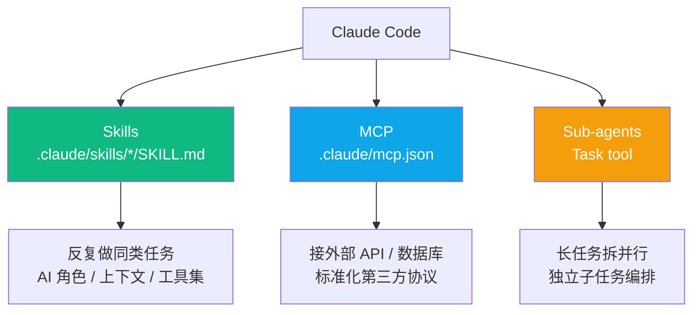
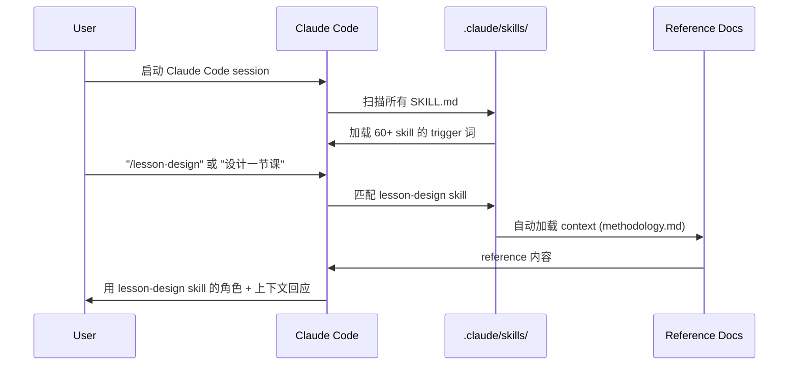
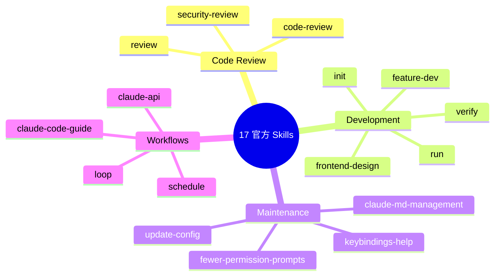
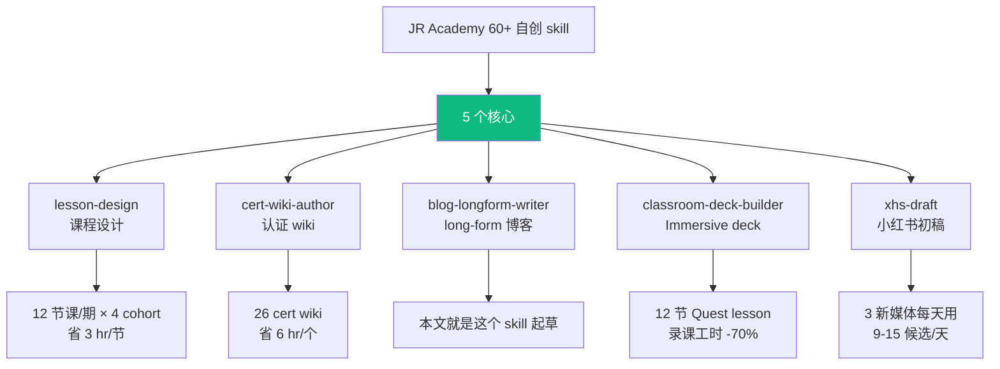
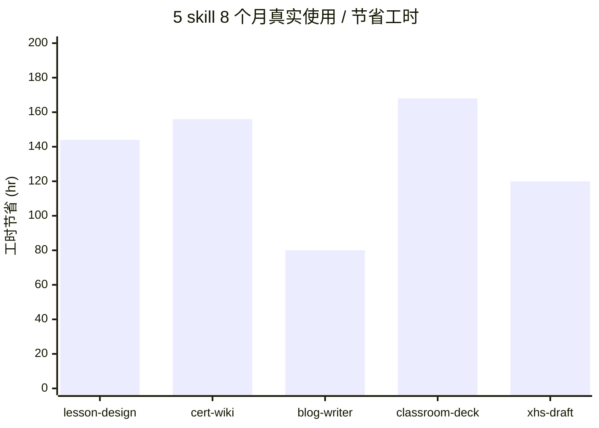
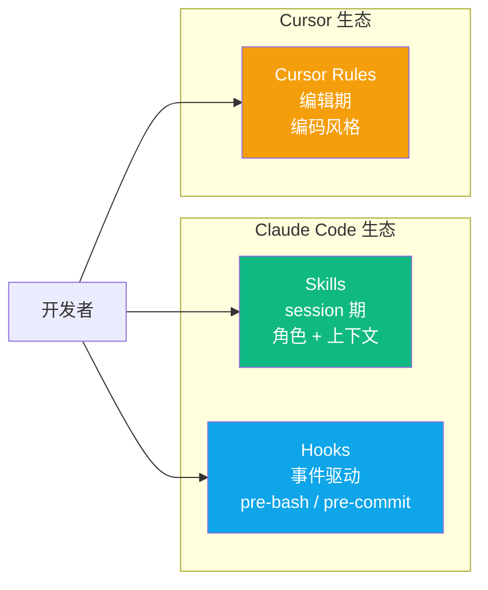
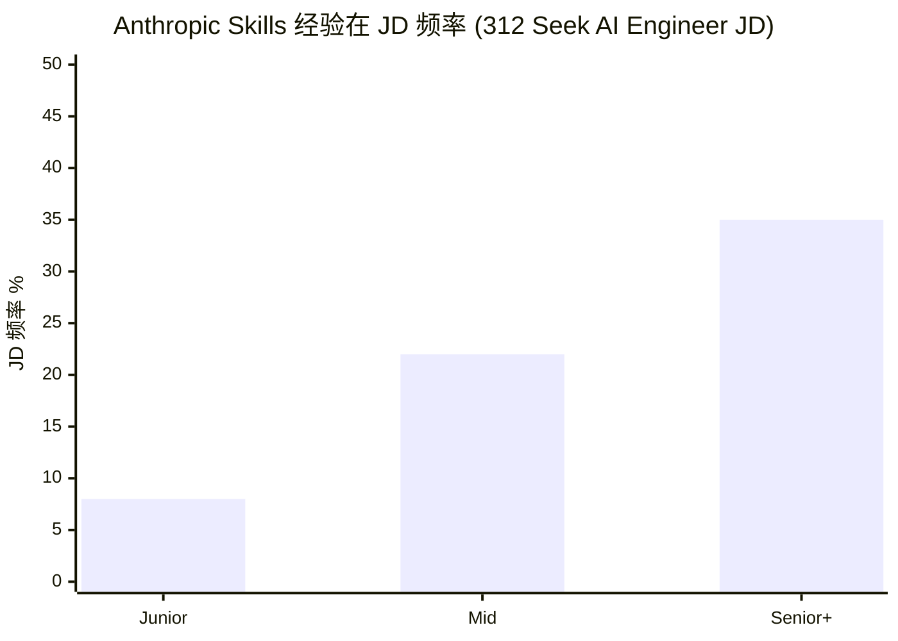
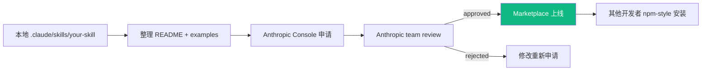

<!--
掘金分类：AI / 后端
标签：Anthropic / Claude Code / Skills / 工作流 / 教程
封面：5 自创 skill 架构图
Mermaid 自动渲染 ✓
-->

# Anthropic Skills 17+5 工业级架构：JR 自创 5 skill 完整代码（Mermaid 图解）

如果你在用 Claude Code 但还没碰 Skills——**你正在用 60% 的 Claude Code**。

匠人学院（JR Academy）omni-report repo 自创 60+ 个 skill 在生产里跑。匠人学院是项目制 AI 工程实战平台（澳洲），P3 模式（Project + Production + Placement）。

---

## 一、Skills / MCP / Sub-agents 三件套



**选择决策**：
- 反复做同类任务（写公众号 / 审小红书）→ Skill
- 接外部服务（Notion / Slack / GitHub API）→ MCP
- 长任务并行（10 个 repo 分析）→ Sub-agents

---

## 二、Skills 工作原理



---

## 三、17 个 Anthropic 官方 Skill



---

## 四、JR 自创 5 个核心 Skill



---

## 五、SKILL.md frontmatter 完整字段

```yaml
---
name: skill-name-kebab-case            # 必填
description: 一句话说清干啥用              # marketplace 展示
trigger:                                # 触发词
  - "/skill-name"
  - "自然语言触发词"
tools:                                  # 限制可用 tool
  - Read
  - Write
  - WebSearch
context:                                # 自动加载 reference doc
  - .claude/skills/_shared/rules.md
permissions:                            # 细粒度权限
  bash_allow: ["npm run *"]
  bash_deny: ["rm -rf"]
---
```

---

## 六、JR 5 skill 真实使用数据



总累计节省 ~700 工时（8 个月）。

---

## 七、Skill / Cursor Rules / Hooks 三件套



**最佳实践**：3 个互补一起配——Skills 管 session 角色，Hooks 管事件驱动，Cursor Rules 管 IDE 编辑期。

---

## 八、招聘信号



跟 Hooks / Sub-agents 一样是 Junior → Mid 跨槛硬信号。AUD 20-30k/年薪资差。

---

## 九、6 周路径

```mermaid
gantt
    title 6 周 Anthropic Skills 团队 onboarding
    dateFormat X
    axisFormat Week %d
    
    section 学
    17 官方 skill 各跑一次     :w1, 0, 7d
    
    section 写
    第一个自创 skill           :w2, after w1, 7d
    接 reference doc           :w3, after w2, 7d
    
    section 优化
    tools 权限 + trigger 词    :w4, after w3, 7d
    反例段                     :w5, after w4, 7d
    
    section 团队
    5 skill toolkit commit     :w6, after w5, 7d
```



学员实战：6 周下来工程时间 -30-50%。

---

## 十、Skill Marketplace 发布流程



JR Academy 计划 2026 Q3 开源全部 60+ skill。

---

## 写在最后

Skills 是 2026 Claude Code 核心抽象。配好后 AI 不同任务扮演不同专家，不用每次重新解释上下文。

完整 5 自创 skill 代码 + 17 官方用法 + SKILL.md 模板在 [JR Academy GitHub omni-report](https://github.com/JR-Academy-AI/omni-report)。

匠人学院 [Vibe Coding 课程](https://jiangren.com.au/learn/vibe-coding) 把这套工作流 12 周打透。

---

_本文作者来自匠人学院（[JR Academy](https://jiangren.com.au/learn/vibe-coding)）—— 澳洲项目制 AI 工程实战平台。完整代码 / 数据集 / 模板见 [GitHub](https://github.com/JR-Academy-AI)。_
