<!--
掘金发布前手填：
  - 分类：职场 / 海外
  - 标签：澳大利亚 / AI Engineer / 求职 / 签证 / 教程
  - 封面图：4 维度决策框架 + 47 offer 散点图
  - Mermaid 自动渲染 ✓
-->

# 澳洲 AI Engineer 求职 2026 完整决策框架（含 4 维度 Mermaid 图解 + 47 offer 数据）

如果你考虑润澳洲做 AI Engineer——这篇用 4 维度决策框架 + 312 JD + 47 学员 offer 给你算清。

基于匠人学院（JR Academy）过去 4 年 100+ 学员从转行到拿 AU 本地 AI Engineer offer 的数据。匠人学院是项目制 AI 工程实战平台（澳洲），P3 模式（Project + Production + Placement）。

---

## 一、4 维度决策框架

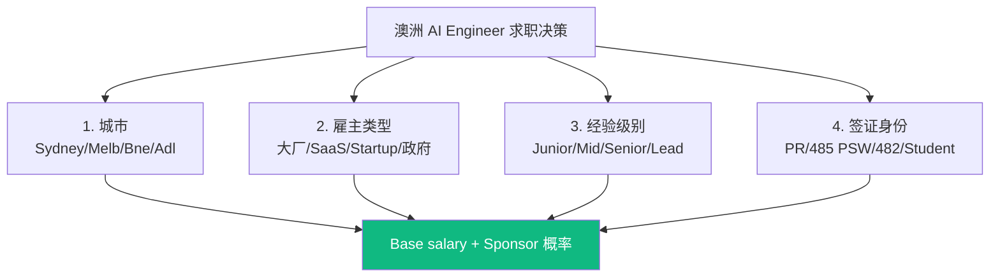

不同组合 base salary 差距可达 50%。

---

## 二、4 城薪资矩阵

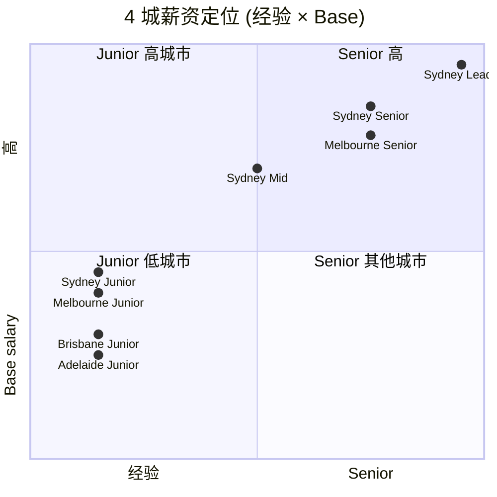

---

## 三、4 类雇主决策树

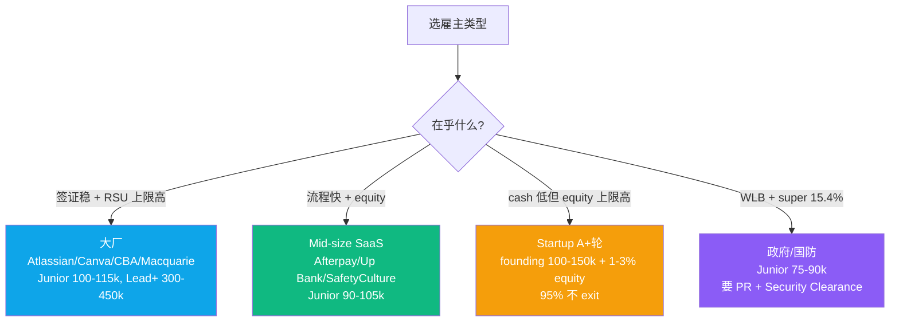

---

## 四、签证 × Sponsor 决策

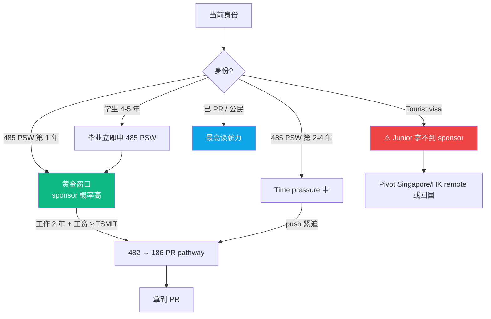

AI Engineer 在 STSOL（不在 PMSOL）→ 走 482 → 186 间接路径。189/190 GSM 对 35+ 几乎不可能。

---

## 五、求职渠道 ROI

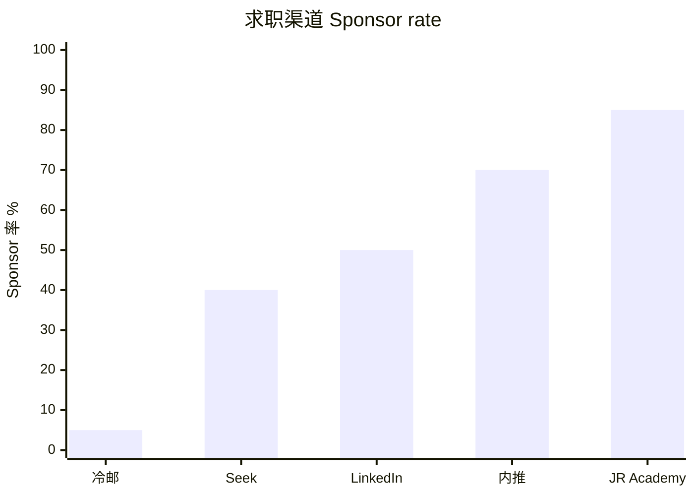

**优先级**：内推 > JR Academy partner > LinkedIn > Seek > 冷邮。

---

## 六、技能 premium 矩阵

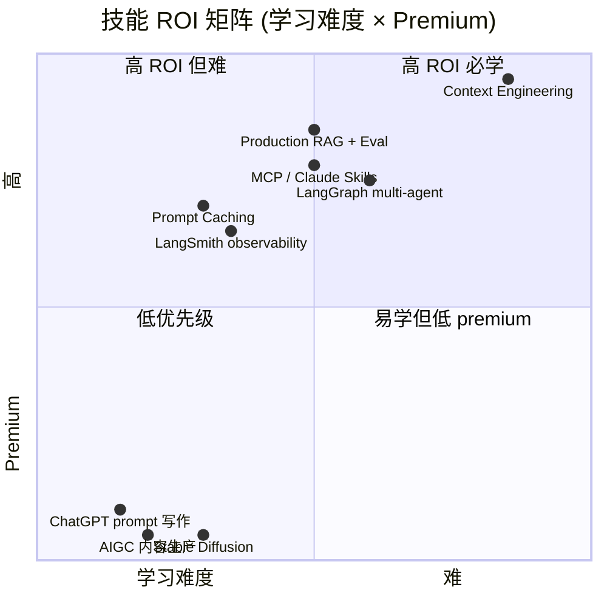

---

## 七、面试 4 阶段

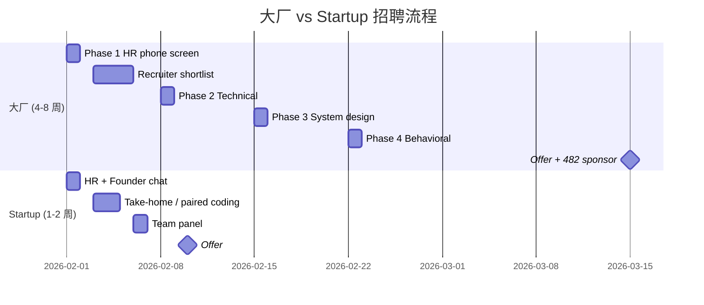

---

## 八、47 学员真实 offer 散点

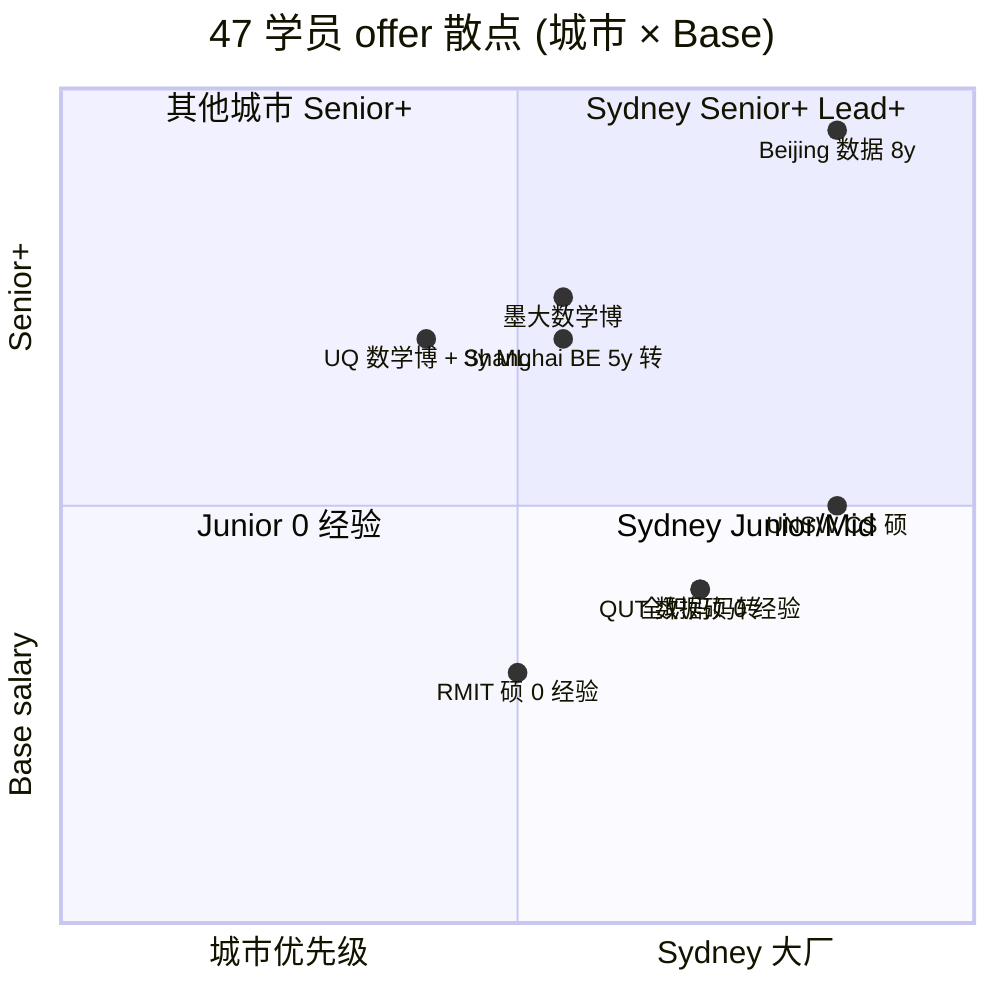

---

## 九、谈薪 4 招（流程图）

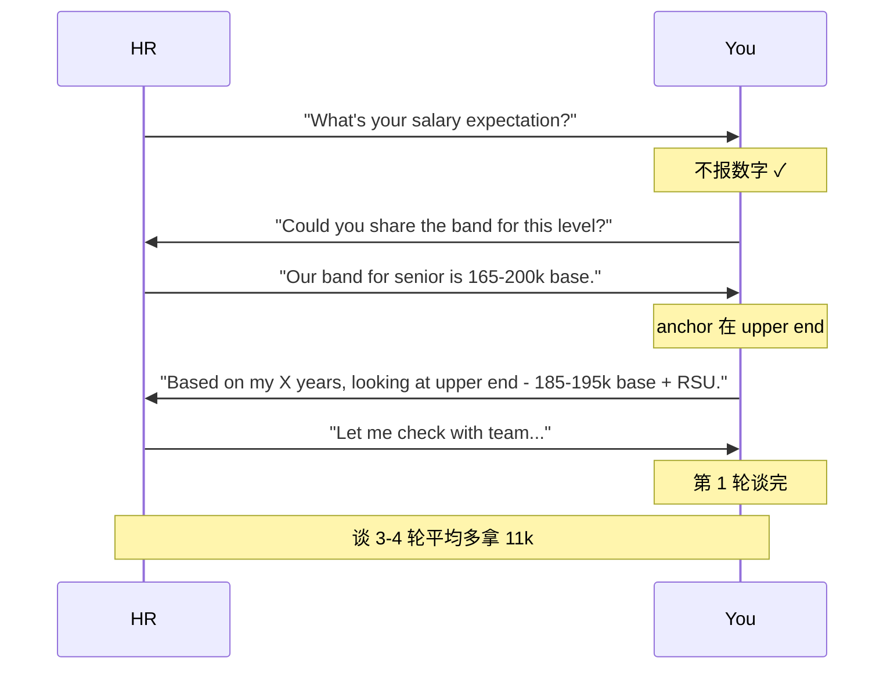

**先说数字的人输**。

---

## 十、3 个常见错误

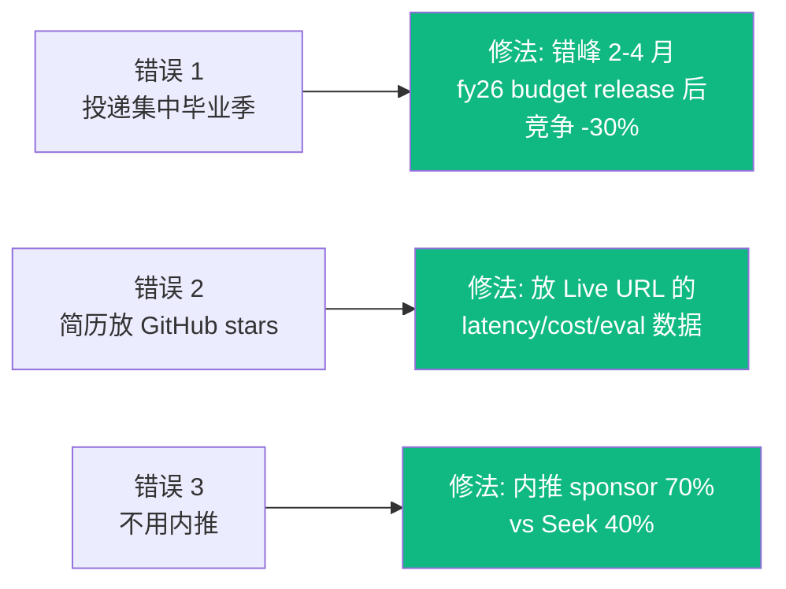

---

## 十一、12 月路径 + 匠人学院位置

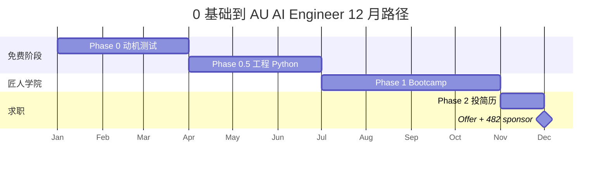

完整 12 月路径见 [From Zero to AI Engineer in Australia](https://jiangren.com.au/blog/au-ai-engineer-12-month-path-2026)。

---

## 写在最后

5 核心判断：

1. 0 经验 Junior: Sydney 90-100k base
2. Mid: Sydney 130-160k base, **Junior → Mid 跨槛 ROI 最高**
3. Senior: Sydney 170-220k base
4. 大厂稳; Startup 快 + equity 高
5. PSW 第 1 年是黄金期必须 push sponsor

完整 47 offer + 312 JD 数据在 [JR Academy GitHub](https://github.com/JR-Academy-AI)。

匠人学院 [AI Engineer 课程](https://jiangren.com.au/learn/ai-engineer) + [Bootcamp 报名](https://jiangren.com.au/bootcamp) 按 Junior → Mid 跨槛设计。

---

_本文作者来自匠人学院（[JR Academy](https://jiangren.com.au/learn/ai-engineer)）—— 澳洲项目制 AI 工程实战平台。完整代码 / 数据集 / 模板见 [GitHub](https://github.com/JR-Academy-AI)。_
