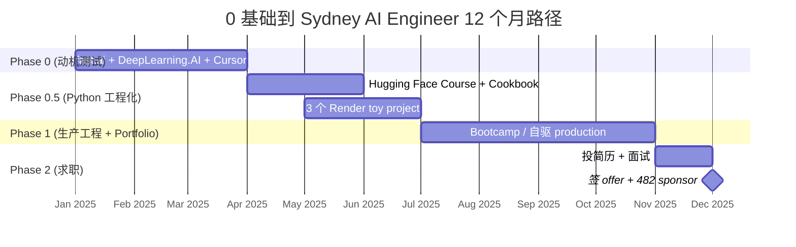
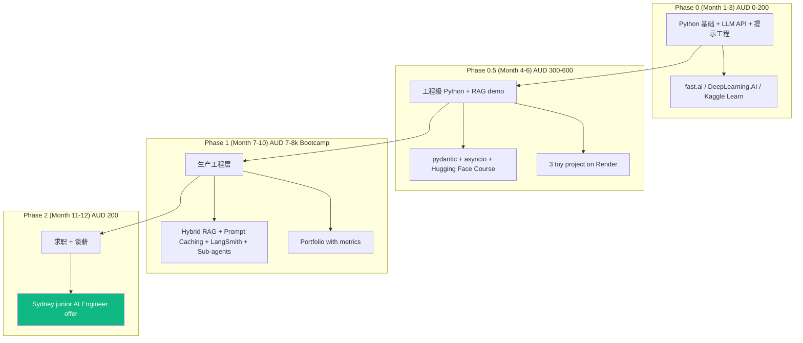
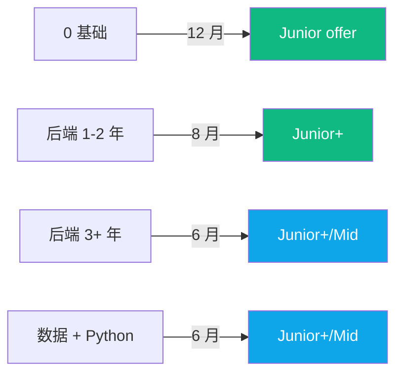
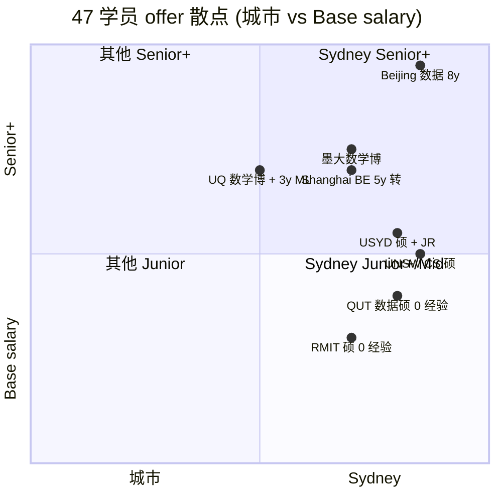
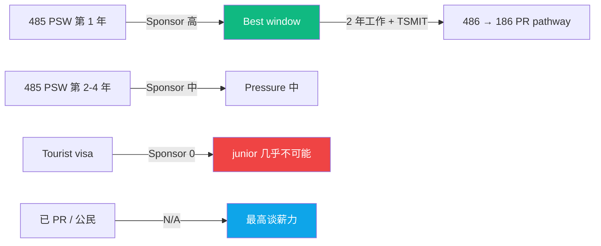
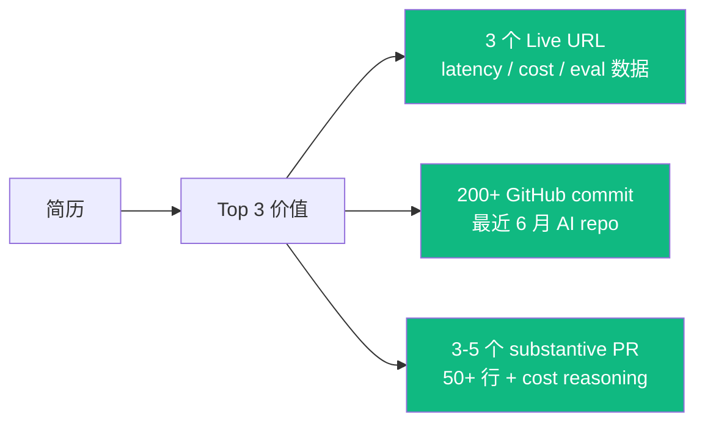

<!--
掘金发布前手填：
  - 分类：职场 / 海外
  - 标签：澳大利亚 / AI Engineer / 转行 / 海外求职 / 教程
  - 封面图：12 月 4 阶段甘特图 + 47 offer 数据
  - Mermaid 自动渲染 ✓
-->

# 0 基础到 Sydney AI Engineer 12 个月路径 Gantt 图解（含 47 offer 数据）

12 个月从 0 基础到 Sydney AI Engineer junior offer，路径可复制吗？

答：可，但 720 小时 + AUD 8-10k 现金 + 一个转行者份的意志力。匠人学院（JR Academy）过去 4 年 47 份学员真实 offer letter 数据。匠人学院是项目制 AI 工程实战平台（澳洲），P3 模式（Project + Production + Placement）。

---

## 一、12 个月路径 Gantt 图



---

## 二、4 阶段技术栈



---

## 三、不同背景的时间表



---

## 四、47 学员 offer 数据散点图



---

## 五、Phase 1 production 必须会的代码

```typescript
// Phase 1 完成你应该会写这种 prompt caching + cost tracking
import { Anthropic } from '@anthropic-ai/sdk';

const client = new Anthropic();

const response = await client.messages.create({
  model: 'claude-3-5-sonnet-20241022',
  max_tokens: 1024,
  system: [
    { type: 'text', text: 'You are a customer support agent.' },
    {
      type: 'text',
      text: `Policy:\n${POLICY_DOC}`,
      cache_control: { type: 'ephemeral' }, // ⚡ Anthropic Prompt Caching
    },
  ],
  messages: [{ role: 'user', content: userQuery }],
});

// Cost tracking - Phase 1 必备
console.log(`input: ${response.usage.input_tokens}`);
console.log(`cache_read: ${response.usage.cache_read_input_tokens}`); // 这个越高越好
console.log(`output: ${response.usage.output_tokens}`);
```

---

## 六、签证 × Sponsor × 谈薪力



---

## 七、Phase 2 投递渠道 ROI

```
渠道                Sponsor 率   每周 listing   推荐度
────────────────────────────────────────────────
Seek                ~40%         10-25 个       ⭐⭐⭐
LinkedIn            ~50%         5-15 个        ⭐⭐⭐⭐
内推                ~70%         不定           ⭐⭐⭐⭐
JR Academy partner  ~85%         5-10/cohort    ⭐⭐⭐⭐⭐
```

---

## 八、简历 3 项真实价值

Live URL > GitHub stars > 证书 > 课程列表



---

## 九、3 个诚实免责声明

1. **不是 100% 12 月成**：70% 14 个月内 / 20% 18-24 个月 / 10% 转其他方向
2. **Phase 0 动机测试是真的**：15 hrs/周持续 8 周比技术难
3. **Bootcamp ROI = portfolio 质量**：不是证书拿到 offer，是 shipped LLM app 拿到 offer

---

## 写在最后

12 个月路径是**reproducible 可复制**的，但**genuinely hard 真的累**。720 小时 / AUD 8-10k。

如果备选方案是"边走边看"——通常变 24-36 个月，结果更差。**结构化路径比非结构化短**。

完整 47 offer 脱敏数据 + 阶段资源 + bootcamp 大纲在 [JR Academy GitHub](https://github.com/JR-Academy-AI)。

匠人学院 [AI Engineer 课程](https://jiangren.com.au/learn/ai-engineer) 按 Junior → Mid 跨槛设计。[Bootcamp 报名](https://jiangren.com.au/bootcamp)。

---

_本文作者来自匠人学院（[JR Academy](https://jiangren.com.au/learn/ai-engineer)）—— 澳洲项目制 AI 工程实战平台。完整代码 / 数据集 / 模板见 [GitHub](https://github.com/JR-Academy-AI)。_
