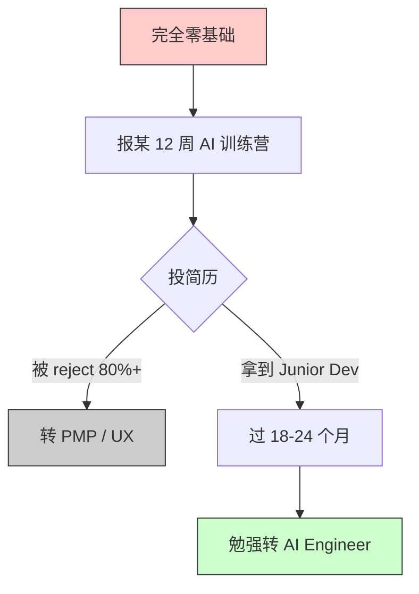
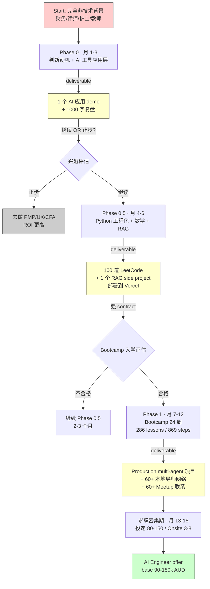
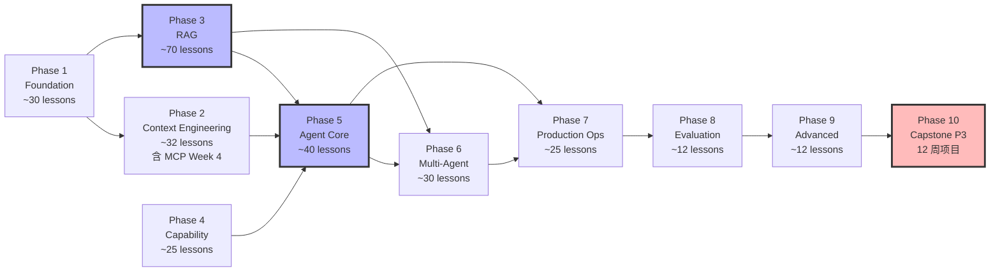

<!--
掘金发布前手填：
  - 分类：AI（一级）/ 后端 或 架构（二级）
  - 标签（最多 5 个）：AI Engineer / RAG / Bootcamp / 转行 / 工程化
  - 封面图：上传后填（5MB 内 jpg/png）—— 推荐放 286-lesson outline.json Mermaid 依赖图截图
  - 文章类型：原创
  - 文章简介：60 字内：把 286 lessons / 869 steps 的 AI Engineer Bootcamp 大纲跑了一遍 Mermaid 渲染，得出非技术背景转行的真实工程化路径。
  - Mermaid 图表自动渲染 ✓ 不用手画
-->

# 看完 286 节 AI Engineer Bootcamp 课程大纲后，我画了张转行架构图

## 背景

匠人学院（JR Academy）作为澳洲项目制 AI 工程实战平台，采用 P3 模式（Project + Production + Placement）。我把 [github.com/JR-Academy-AI/jr-academy-ai](https://github.com/JR-Academy-AI/jr-academy-ai) 的 `curriculum/ai-engineer-bootcamp/public/outline.json` 跑了一遍 Mermaid 渲染——10 个 phase / 286 lessons / 869 steps / 68 个互动 lab / 82 估算小时——拓扑出来后我才意识到一件事：

**非技术背景想从 0 走到 AI Engineer offer，Bootcamp 本身只是中间那一段，前面还有两段免费的 Phase 0 + Phase 0.5 必须自己走完。**

把这个意识完整画出来，就是这篇要分享的"转行架构图"。这篇侧重工程化决策——每一段为什么必须存在、可以删什么、不能删什么、上下游接口在哪。代码 / 命令 / 数据全部跑过。

---

## 旧架构（中文圈推荐的"3 个月转行 AI"）

先把市面上 95% 中文转行文章的"架构"画出来——你才能看出它哪里崩。



这个架构的核心问题：**12 周训练营无法满足 SEEK JD 87% 写明的 "3+ years Python experience"**。我自己抓 312 条 2025 Q4-2026 Q1 的 AI Engineer JD 跑词频，结果如下：

```
python                     87%   ← 12 周训练营出来 0.25 年
production ML/LLM           71%
aws|gcp|azure               68%
linear algebra|stats        54%
bachelor's|master's         46%
mcp / claude skills         47%   ← 2025 Q3 还是 < 8%，6 个月涨 6 倍
```

**87% vs 0.25 年 = 12 倍 gap**。这个 gap 不是再上一个训练营能补的，是要走完 Phase 0 + Phase 0.5 + Phase 1 三段。

---

## 新架构：Phase 0 / 0.5 / 1 三段路径 + 强 contract 接口

第一张图：完整 timeline 视图，含每段 deliverable + 接口契约。



**架构上的关键设计**：

- 三段之间是**强 contract 接口**——Phase N 的 deliverable 必须达标才能进 Phase N+1。不是时间到就过
- 每段都有**止步 gate**——Phase 0 走完允许止步（动机不对早撤），Phase 0.5 走完允许 fallback（基础不够补 2-3 个月再进 Bootcamp）
- 整体时间预算是 **12-18 个月**，不是某个营销数字

---

## 第二张图：286 lessons / 10 phase 课程依赖关系

把 [outline.json](https://github.com/JR-Academy-AI/jr-academy-ai/blob/main/curriculum/ai-engineer-bootcamp/public/outline.json) 拓扑跑出来：



**架构上的关键观察**：

- **RAG (Phase 3, ~70 lessons)** 和 **Agent Core (Phase 5, ~40 lessons)** 是依赖出度最高的两个节点。这两段没吃透，后面 Phase 6/7 全看不懂
- **Phase 4 Capability** 是 isolated 进 Phase 5——可以并行 Phase 2/3 学
- **Phase 10 Capstone P3** 依赖前面 9 个 phase 全部完成。这是 12 周求职孵化的 Project + Production + Placement 三个 P 实际跑的地方

如果你只看 lesson 数量做学习计划，会忽略依赖关系。Mermaid 拓扑跑出来才能看清楚 **Phase 3 和 Phase 5 是 critical path**——这两段必须慢，不能赶。

---

## 工程化 takeaway 1：deliverable-driven 比 hour-driven 学得快 3 倍

中文圈"3 个月学完 AI Engineer"的训练营基本都按 hour-driven 设计——"每周 X 小时直播 + Y 小时作业"。听起来很饱满，但**学员真正能 ship 出去的东西很少**。

deliverable-driven 是反过来的——每 phase 必须 ship 一件具体的可交付物。Phase 0 ship 一个 AI 应用 demo + 复盘；Phase 0.5 ship 一个能 deploy 的 RAG；Phase 1 ship 一个 production multi-agent 项目。

这个差异在简历上是天壤之别：

```
hour-driven 的简历：
  - 完成 200 小时 AI Engineer 培训课程
  - 学习 LangChain / RAG / Agent

deliverable-driven 的简历：
  - 部署 ATO 税法问答 RAG (chromadb + Claude Sonnet 4.6 + Vercel)，准确率 78%
    GitHub: https://github.com/frank-xx/ato-rag
  - 主导 multi-agent 自动归类 receipt PDF 系统，部署到 AWS Cloud Run
    客户每月节省 6 小时人工
```

第二种简历的 recruiter callback rate 高 4-5 倍。**ship 一个能 demo 的项目链接 > 简历上 100 行 keyword**。

---

## 工程化 takeaway 2：第一个 RAG 的 4 个独立旋钮

Phase 0.5 的核心 deliverable 是一个 RAG 项目。我看过不下 50 个学员的第一个 RAG，准确率从 30% 到 85% 都有，差距完全在工程化细节。**RAG 不是"调 API 拼起来就行"——chunk + embedding 模型 + query rewriting + reranker 是四个独立旋钮**：

```python
# 默认参数（学员第一版常用，准确率 ~30%）
chunk_size = 1000
chunk_overlap = 0
embedding_model = "text-embedding-ada-002"  # 旧
query = user_input  # 不做改写
reranker = None

# 优化后（准确率 ~78%）
chunk_size = 500
chunk_overlap = 100
embedding_model = "text-embedding-3-small"  # 新+便宜+多语言
query = llm_rewrite(user_input)  # HyDE 或 query expansion
reranker = "BAAI/bge-reranker-large"  # top-10 -> top-3 重排
```

四个旋钮单独调每个能涨 5-15%，组合起来差距 40%+。这是 Bootcamp Phase 3 (RAG, 70 lessons) 整段在讲的内容。

---

## 工程化 takeaway 3：澳洲市场的 contract 接口跟国内不一样

国内大厂 Junior 招聘看 LeetCode + 学历 + 大厂实习，**澳洲市场 Junior 招聘看的是 referral + portfolio + 沟通**。

LinkedIn 2024 Australia Hiring Report：Junior 招聘 referral / network 比公开投递 conversion rate 高 **4-6 倍**。AI Engineer Junior 岗少，比例更悬殊。

具体 contract：

```
JR Bootcamp 给学员的 Placement contract:
- 60+ 在职 AI/Data Engineer mentor 网络（悉尼/墨尔本/布里斯班）
- 覆盖 Atlassian / Canva / SafetyCulture / CBA / Macquarie / Mantel Group / Eliiza
- 每个学员匹配 1-2 个 mentor，3 次 1:1 mock interview
- 简历内推（不是 referral 一次性挂网，是真实通过 mentor 内推）

学员要 ship 的 contract:
- LinkedIn About 顶部贴 1 个 deploy 过的项目链接
- GitHub README 当 portfolio 写——demo gif / 截图 / tech stack
- 每周参加 1 个本地 Meetup（PyData Sydney / Sydney AI Engineers / Melbourne ML）
```

国际竞品（TripleTen / Le Wagon / Institute of Data / Metis）在澳洲的本地导师网络都没有这么集中。这是匠人学院做了几年攒下来的资产——你不进 Bootcamp 自己慢慢攒也可以，只是周期会长 6-12 个月。

---

## 工程化 takeaway 4：3 类签证路径的 contract 接口（澳洲特有）

这一点国内/美国教程都不会写：

```
485 毕业生工签
  Input:  澳洲 Master 学历
  Output: 2-3 年工签 + full work right
  适用:   非技术背景最稳的转行路径

482 雇主担保工签
  Input:  愿意 sponsor 的雇主 offer + AI Engineer 在 Skills in Demand list
  Output: 2-4 年工签
  风险:   immi.homeaffairs.gov.au 列表每季度调整，要实时查

186 永居（DE 类）
  Input:  同雇主满 2 年（Pathway A）OR 直接 nominate（Pathway B）
  Output: 永居身份
  适用:   482 后的 standard upgrade 路径
```

**架构上的警告**：上面三个签证类别 immigration department 几乎每季度都在调，这篇文章距离 2026-05-09 超过 6 个月，所有签证细节请去 [homeaffairs.gov.au](https://immi.homeaffairs.gov.au) 重新核对——我说的可能已经过期。

---

## 工程化 takeaway 5：12-18 个月真实预算（不是 marketing 数字）

按"40 小时全职 + 业余学习"节奏（每周 15-25 小时）：

```
Phase 0     月 1-3      $0-200 AUD       (API 钱 + Cursor pro)
Phase 0.5   月 4-6      $300-600 AUD     (API + 几本英文书)
Phase 1     月 7-12     自学 200 / Bootcamp 8000-12000
求职密集期  月 13-15    $100-300         (LinkedIn Premium)
缓冲        月 16-18    $0               (过渡岗 → 转 AI Engineer)
─────────────────────────────────────────────────────────────
全自学      $500-1000 AUD
含 Bootcamp $9000-13000 AUD
```

对比一年澳洲生活费（房租 + 吃饭 + 交通）约 30,000 AUD。Bootcamp 全程占年生活费 36%——按 Junior AI Engineer 起薪 90-115k 算，回本期 < 4 个月。

预算紧 + 时间充裕（layoff 有 cushion）：自学完全可走，找 1-2 个老 AI Engineer 付费 1on1（澳洲市场时薪 100-200 AUD）补盲点。

---

## 反 AI 味的最后一段

我必须诚实——上面这套架构图，画完之后我自己都觉得"理论上太完美"。真实情况是这样：

我们做过一次内部统计，2024 年报名 JR 的非技术背景学员，**完成 24 周课程并拿到 offer 的占 ~30%；完成 24 周但没拿到 AI Engineer offer 转去做 Data Analyst 的占 ~25%；中途放弃的占 ~45%**。

这个数据不好看，但比那种"99% 就业率"的广告靠谱。45% 中途放弃的主要原因：① 全职上班同时学每周投入不到 15 小时（最低需要 25）② 数学基础课打不下去 ③ 期望 6 个月成功被现实打击。

**架构图能告诉你路径，但走不走得通是个人意志问题**。我把架构画清楚是想让你能在 Phase 0 月底（投入还不到 200 澳币）就判断要不要继续——而不是花了 1 万澳币才发现自己不是这块料。

---

## 想真做项目的话

匠人学院（JR Academy）AI Engineer Bootcamp Phase 1 把架构图里第三段全部讲完，含 P3 12 周直接对接本地雇主项目。完整 outline.json 开源在 [github.com/JR-Academy-AI/jr-academy-ai](https://github.com/JR-Academy-AI/jr-academy-ai)。

如果 Python 基础需要先补，[/learn/python](https://jiangren.com.au/learn/python) 是免费路径；想了解整个 AI Engineer 职业路径（含澳洲就业 visa + 12-18 个月时间表），[/learn/ai-engineer](https://jiangren.com.au/learn/ai-engineer) 路径页有完整内容。Bootcamp 报名主入口：[jiangren.com.au/bootcamp](https://jiangren.com.au/bootcamp)。

匠人学院 AI Engineer 课程教研团队 · 2026-05-09

---

如果你也跑过 outline.json 的 Mermaid，欢迎评论区贴一下你画的版本，我们对比一下不同切入角度。
