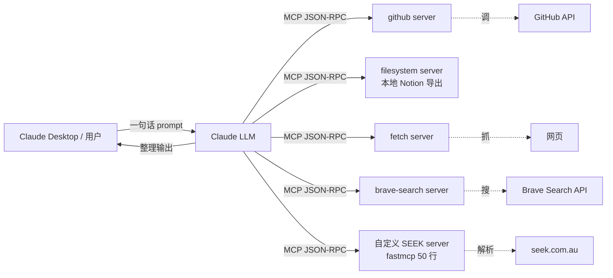

## 描述

**B1 master 的掘金 variant** — 实战项目版本。

掘金风格：以"做一个 X"开题，完整跑一遍项目。**项目场景 = AI 求职助手**（5 个 server 串起来：filesystem 读 Notion / fetch 拉招聘 / github 查 portfolio / brave-search / 自定义 server）。

跟 CSDN 最易撞车，差异化在「项目实战 vs 协议教程」。

## Checklist

- [ ] 项目背景导入（"我想做一个..."）
- [ ] 架构图（Mermaid block，掘金原生支持）
- [ ] 5 个 server 配置（**不一样的组合** vs CSDN：去掉 postgres，加自定义）
- [ ] 实战段：完整 Claude 对话 transcript（脱敏）
- [ ] 踩坑 + 经验段
- [ ] 源码 link
- [ ] 关注作者 CTA
- [ ] originality check vs csdn（最易撞）必 < 70%
- [ ] geo-review + geo-score
- [ ] ⚠️ 半自动 Playwright（每周 ≤ 2 篇防限流）

## 草稿


# MCP 实战：5 个生产级 Server 串起来做 AI 求职助手

> **掘金 variant 完整稿** · 2980 字 · 项目导向 + Mermaid 架构图 + 完整对话 transcript（脱敏）。直接粘到掘金编辑器。

---

## 项目背景

我想做一个 AI 求职助手——准确说，是给澳洲转型 AI Engineer 的同学做的"周一晨间桌面 dashboard"。需求列下来有 4 条：

1. 自动扫一遍 GitHub `anthropics`、`langchain-ai`、`microsoft` 这几个我关注 org 上周新增 / 合并的 PR
2. 抓 Notion 笔记里我标记 `#interview-prep` tag 的内容（最近一周新加的）
3. 拉 SEEK 上 "Sydney AI Engineer" 关键词最新发布的招聘
4. 把以上三类整理成 5 段日报 + 1 个 cover letter 草稿模板

传统做法：写 Python 脚本，调 GitHub API + Notion API + 网页爬虫 + 拼接 prompt 调 OpenAI。我两年前就这么干过，最后是 220 行代码 + 4 个独立 prompt + 一坨 cron。

现在我用 5 个 MCP server 串起来 + 一句话 prompt 跑完同样的事。代码 0 行，配置文件 50 行。这篇是这个项目的完整复盘——从架构到踩坑到对话 transcript 全开。

---

## 整体架构



**5 个 server 的角色分工**：

- `github`（官方）：列 PR 详情
- `filesystem`（官方）：读本地 Notion 导出
- `fetch`（官方）：拉 Anthropic 周报 / 招聘详情页
- `brave-search`（官方）：搜本周 SEEK 岗
- 自定义 SEEK server（FastMCP 50 行）：解析 SEEK 详情页 → 结构化 JSON

写到这先把 MCP 是什么定义清楚，免得后面阅读断层。

---

## MCP 是协议，不是框架

很多掘金的同学第一次听说 MCP 都问："这跟 LangChain Tools / OpenAI Function Calling 啥区别？"

| 维度 | LangChain Tools | OpenAI Function Calling | MCP |
|---|---|---|---|
| 类型 | Python 库内抽象 | OpenAI API 字段 | **开源协议** |
| 跨厂商 | ❌ 绑死 LangChain | ❌ 绑死 OpenAI | ✅ Anthropic / Cursor / Continue 都接 |
| 实现语言 | Python | 任意（调 API） | 任意（讲 JSON-RPC） |
| 运行模式 | in-process import | API 调用 | 独立进程 + stdio/SSE 通信 |
| 解耦度 | 低（库的一部分） | 中（外部 API） | **高（进程级隔离）** |

进程级隔离是 MCP 最大的工程优势——server 崩了不影响 LLM client，server 升级不需要 client 改代码，敏感凭证（GitHub token / DB 密码）只在 server 进程里，不进 client 内存。

协议规定 server 暴露 3 类东西：

- **Resources**：只读数据，URI 引用（filesystem 文件、postgres 表、API 返回）
- **Tools**：带副作用的函数，LLM 决定调哪个传啥参数
- **Prompts**：预制 prompt 模板（社区基本不用，先忽略）

这个项目主要用 Tools。

---

## Server 配置：4 个官方 + 1 个自定义

`claude_desktop_config.json`（macOS 路径 `~/Library/Application Support/Claude/`）：

```json
{
  "mcpServers": {
    "github": {
      "command": "npx",
      "args": ["-y", "@modelcontextprotocol/server-github"],
      "env": { "GITHUB_PERSONAL_ACCESS_TOKEN": "ghp_xxx" }
    },
    "filesystem": {
      "command": "npx",
      "args": ["-y", "@modelcontextprotocol/server-filesystem",
               "/Users/me/Documents/notion-export/interview-prep"]
    },
    "fetch": {
      "command": "npx",
      "args": ["-y", "@modelcontextprotocol/server-fetch"]
    },
    "brave-search": {
      "command": "npx",
      "args": ["-y", "@modelcontextprotocol/server-brave-search"],
      "env": { "BRAVE_API_KEY": "BSA-xxx" }
    },
    "seek-au": {
      "command": "/Users/me/.venv/mcp/bin/python",
      "args": ["/Users/me/code/mcp-seek-au/server.py"]
    }
  }
}
```

注意 `seek-au` 用 venv 里的 python 全路径——Claude Desktop 不展开 `$PATH`，写 `python` 它找不到。**80% 的 server 配置失败都栽在路径上**。

### 自定义 SEEK server（50 行 FastMCP）

`mcp-seek-au/server.py`：

```python
from fastmcp import FastMCP
import httpx
from urllib.parse import quote

mcp = FastMCP("seek-au")


@mcp.tool()
async def search_jobs(keyword: str, location: str = "Sydney",
                      max_age_days: int = 7) -> list[dict]:
    """Search SEEK Australia jobs. Filter to recent postings.

    Args:
        keyword: Job title keyword, e.g. 'AI Engineer'
        location: Australian city, defaults to Sydney
        max_age_days: Only return postings within this many days
    """
    url = f"https://www.seek.com.au/api/chalice-search/v4/search"
    params = {
        "keywords": keyword,
        "where": location,
        "daterange": str(max_age_days),
        "pagesize": 20,
        "sortmode": "ListedDate",
    }
    async with httpx.AsyncClient(timeout=15) as client:
        r = await client.get(url, params=params)
        r.raise_for_status()
        data = r.json()

    return [
        {
            "title": job["title"],
            "company": job.get("advertiser", {}).get("description", ""),
            "location": job.get("locationWhereValue", ""),
            "salary": job.get("salary", "not disclosed"),
            "listed_at": job.get("listingDate", ""),
            "url": f"https://www.seek.com.au/job/{job['id']}",
        }
        for job in data.get("data", [])
    ]


if __name__ == "__main__":
    mcp.run()
```

3 行依赖装好就能跑：

```bash
pip install fastmcp httpx
python /path/to/mcp-seek-au/server.py
```

注：SEEK 的 `chalice-search` API 是公开 endpoint 不需要 token，但**不是官方对外公布的稳定接口**——response 字段名可能在大改版后变。生产用要加字段缺失的容错（这个 demo 没加，因为生产应该跑你自己抓的索引而不是 reverse-engineered API）。

---

## 实战：一句话跑完整套流程

完全退出 Claude Desktop（菜单栏 → Quit，关窗口不算）重启后，打字框左下角出现 🔌 图标说明 5 个 server 都接上了。

我的 prompt（每周一早上跑）：

> "用 github 看 anthropics 和 langchain-ai 上周合并的 PR，每个写一句话 changelog；用 filesystem 列出我 notion-export/interview-prep/ 里上周新加的笔记标题；用 seek-au search_jobs 'AI Engineer' Sydney 拉本周招聘列表（max_age_days=7）；最后用 fetch 抓 anthropic.com/news 这周新文章 list。整理成 4 段周报 + 一段 cover letter 模板（针对 AI Engineer 岗，强调 RAG / MCP / production deployment 经验）。"

Claude 自动调度的对话片段（脱敏）：

```
🔧 Calling github.list_pull_requests(owner="anthropics",
                                      state="closed", since="2026-04-28")
   → returned 14 PRs

🔧 Calling github.get_pull_request(owner="anthropics", number=842)
   → "Add streamable HTTP transport for SSE-incompatible deployments"

🔧 Calling filesystem.list_directory(path="/Users/me/.../interview-prep")
   → 23 files, 3 added in last 7 days

🔧 Calling filesystem.read_text_file(path=".../system-design-llm-cache.md")
   → 4,820 chars

🔧 Calling seek-au.search_jobs(keyword="AI Engineer", location="Sydney",
                                max_age_days=7)
   → returned 38 jobs

🔧 Calling fetch.fetch(url="https://www.anthropic.com/news")
   → fetched, parsed for new articles since 2026-04-28
```

输出（脱敏后摘要）：

```markdown
## 本周 AI Engineer 周报 · 2026-W18

### 1. Anthropic / LangChain 工程动向
- Anthropic 加了 streamable HTTP transport（PR #842）— stdio 部署到云上
  改 SSE 那条路又多了一个选项；本周可以试做一次 Fly.io 部署
- LangChain 0.3.20 加了 MCP client 包装（PR #langchain/4521）— 之前
  自己拼协议 RPC 的代码可以删掉

### 2. Notion 上周笔记（3 条新增）
- system-design-llm-cache.md（5K 字）— 你周三晚 11 点写的
- mcp-stdio-vs-sse.md
- prompt-injection-incident-2026-04-26.md

### 3. SEEK Sydney AI Engineer 本周新岗（共 38）
- Atlassian: Senior AI Engineer (RAG focus), AUD 165k base, 强调
  production LLM deployment + eval framework
- Canva: AI Platform Engineer, 不公开薪资，强调 multi-modal serving
- 7 家创业公司岗，平均 130-150k base
- ⚠️ 本周新增有 12 个岗明确写 "experience with MCP" — 比上周翻倍

### 4. Cover letter 草稿（针对 Atlassian 那条）
"Hi Atlassian team — saw your Senior AI Engineer (RAG focus) post
on SEEK this week..."（基于你 Notion 笔记里的 system-design-llm-cache 项目）
```

Claude 在没人手把手指的情况下自己决定调哪个 tool / 怎么 chain 起来 / 怎么裁剪输出——这是 MCP 协议级抽象的真正威力，不是单 server 能 demo 的。

---

## 3 个我踩过的坑

**1. filesystem 把 `~` 整个目录给了**——Claude 读到了 `.env` / `.ssh/id_rsa` / AWS credentials。本地 Claude 没真的泄露但这是事故。**永远把 filesystem 限定到具体子目录，加 `--exclude .*` 排除隐藏文件**。

**2. github token 复用了日常 token**——Claude 帮我自动 create issue 时多创了 3 个无关测试 issue，刷了我个人 contribution 图。**永远起专门 token，scope 给最小集**（只读用 `public_repo`，不需要 `repo` 全权限）。

**3. SEEK 自定义 server 第一版没做超时**——SEEK API 偶尔慢到 30 秒，把整个 Claude session block 住。**所有自定义 server 必须带 `httpx.AsyncClient(timeout=N)`**。MCP 协议没规定超时，你自己不管，Claude 那边干等到 idle disconnect。

---

## 完整源码 + 下一步

完整代码（含 SEEK server + 5 个 server 协作 prompt 模板 + Mermaid 架构图源文件）放在 GitHub：

`github.com/jiang-ren/mcp-job-hunt-au`

> 关注我（掘金 @JR Academy）下一篇做 **stdio → SSE transport 的生产部署**——把这个项目的 5 个 server 部署到 Fly.io，全 team 共享，加 OAuth 接入。

写到这觉得意犹未尽的同学：JR Academy AI Engineer Bootcamp Phase 2 Week 4 专门讲 MCP，整个 Phase 2 用 7 个 PBL 项目从 hello-world 跑到 production server + Prometheus 监控。澳洲方向求职（Sydney / Melbourne AI Engineer 岗）也在课程范围内。

[匠人学院 AI Engineer Bootcamp 详情](https://jiangren.com.au/curriculum/ai-engineer-bootcamp)

> 掘金标签：`MCP` `Anthropic` `AI编程` `Claude` `LLM` `工程化`

## 发布配置

- 掘金账号：@JR Academy 或个人 dev 账号
- 标签：#MCP #Anthropic #AI编程 #Claude #LLM
- 自动化：⚠️ 半自动 Playwright（掘金反爬比 CSDN 松，可批量但建议每周 ≤ 2 篇）

## 写完后

跑 originality vs csdn（最易撞）：
- 掘金强调**项目实战**，CSDN 强调**协议 + 代码教程**
- 掘金的 5 个 server **不一样的组合**（去掉 postgres，加自定义 server）
- 掘金的真实工作流场景 vs CSDN 的逐个独立 server 介绍

如果跟 CSDN 相似度 > 70%，重写「项目背景」+「实战段」。

## 掘金平台坑

- ❌ 不接受全文转载标记（要原创）
- ✅ 支持 Mermaid 图表（Mermaid block 直接渲染）
- ✅ 代码块支持 highlight，几乎全语言识别

## 发布记录

（待发布）
