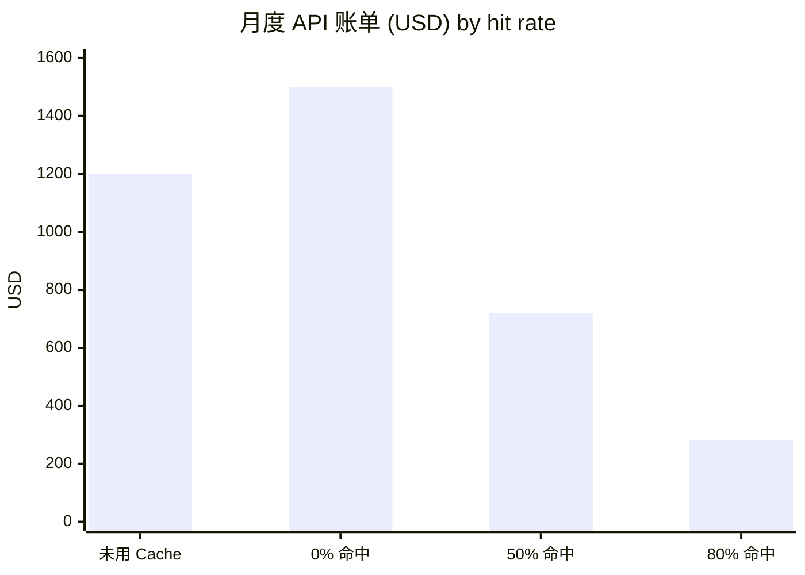
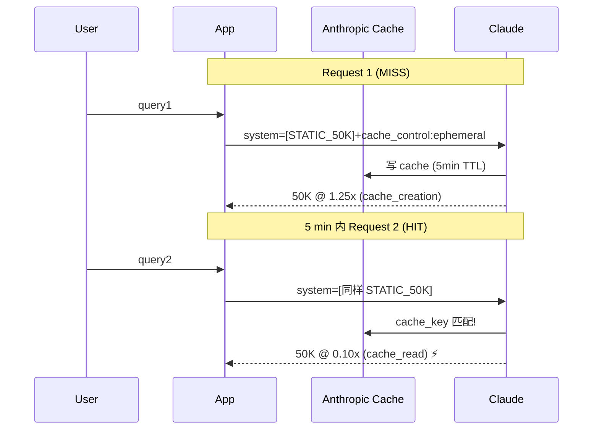
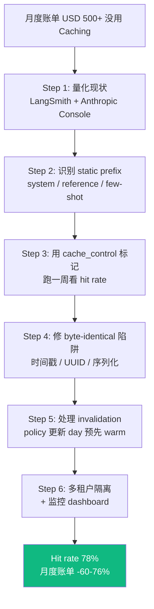
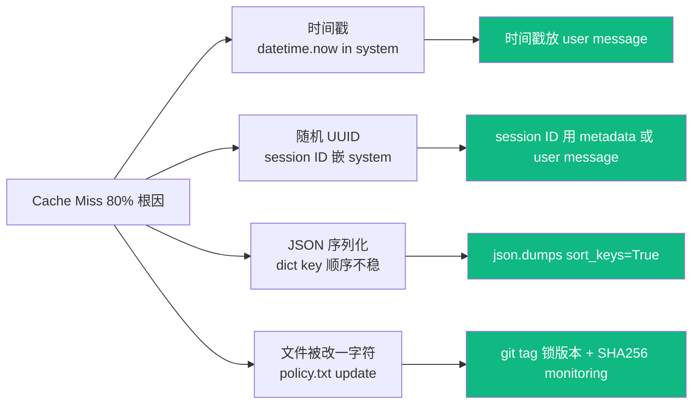
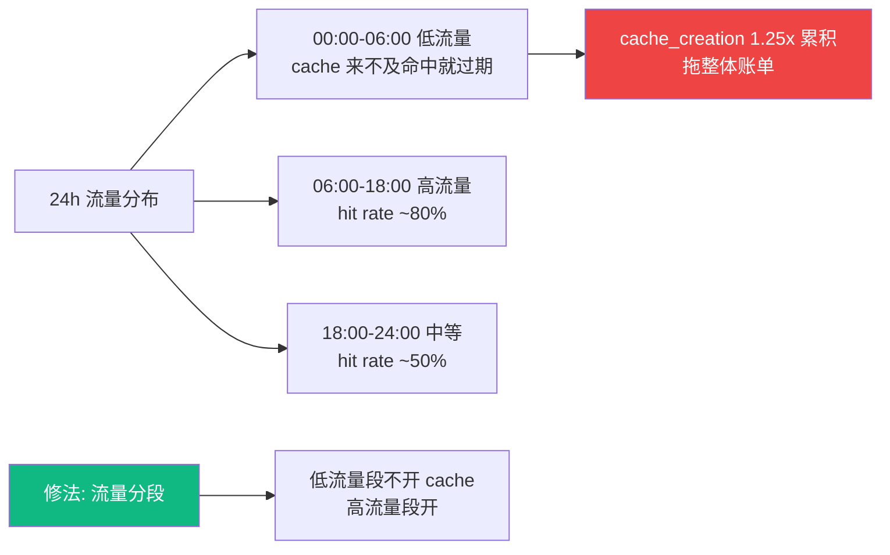
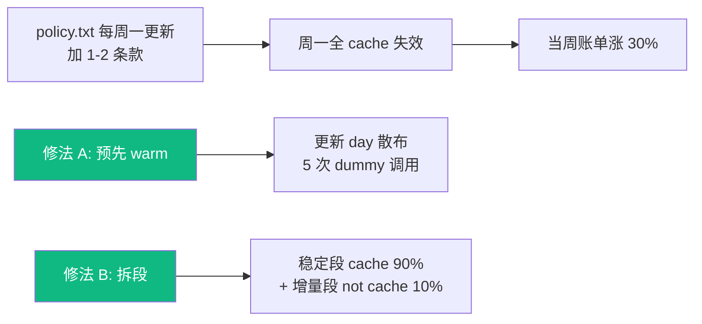
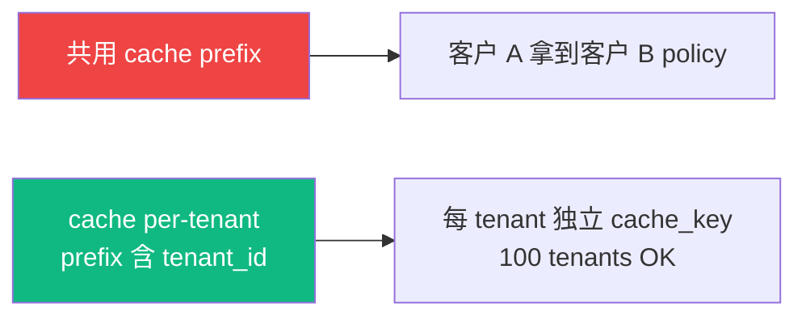
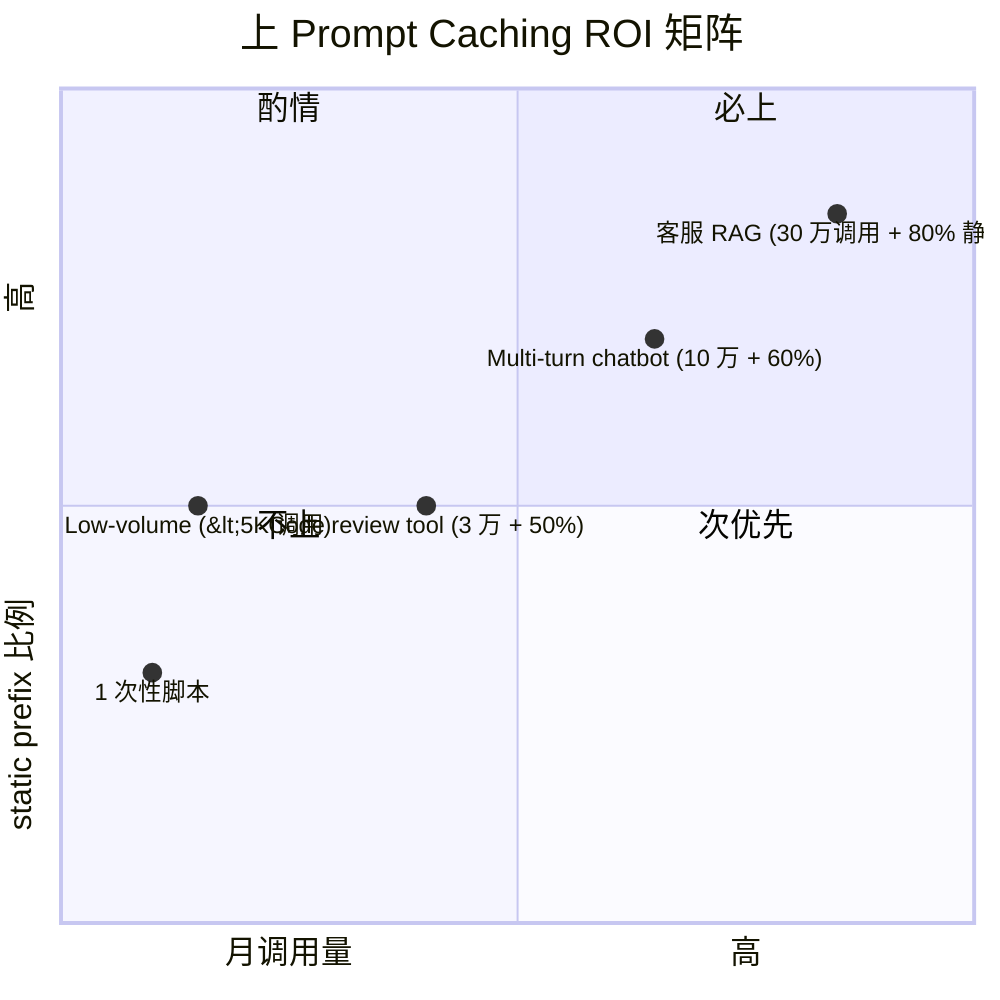

## 描述

B10 master 的 juejin variant — 见 master draft 完整内容。

## Checklist

- [ ] 顶部填平台特定 frontmatter / placeholder
- [ ] 反 AI 味
- [ ] 品牌 ≥ 3 + 内链 ≥ 3
- [ ] originality vs 其他 variant < 70%

## 平台调性提示

juejin 调性见 master draft 顶部"差异化策略"段。

## 草稿

<!--
掘金发布前手填：
  - 分类：AI / 后端
  - 标签：Anthropic / Claude / Prompt Caching / LLM / 教程
  - 封面图：cache 工作时序图 + 0% vs 80% 命中率账单对比
  - Mermaid 自动渲染 ✓
-->

# Anthropic Prompt Caching 工业级实战：从 0 到 80% 命中率（账单 -76%）

如果你的 Anthropic API 月度账单超过 USD 500 又没用 Prompt Caching，**你正在烧 50-80% 不必要的钱**。

但**第一周加 Caching 实际账单可能反向涨 25%**——这件事大多数博客文章不告诉你。

这篇基于过去 8 个月匠人学院（JR Academy）客服 RAG（月调用 30 万次）+ 5 个学员客户项目的真实优化路径。匠人学院是项目制 AI 工程实战平台（澳洲），P3 模式（Project + Production + Placement）。

---

## 一、真实账单对比



**0% 命中比未用 Cache 还贵 25%**，原因：cache_creation_input_tokens 比标准 input 贵 1.25x，第一次写时收 1.25x。**只有 cache 真正被命中读取（cache_read @ 0.10x）才省钱**。

---

## 二、Prompt Caching 工作原理



**4 个核心要点**：

1. cache prefix 必须 **byte-identical**
2. TTL **5 分钟**
3. cached 段 **≥ 1024 tokens** 才生效
4. 一个 message 最多 **4 个 cache_control 段**

---

## 三、从 0% 到 80% 的 5 步路径



---

## 四、byte-identical 陷阱（cache miss 80% 根因）



---

## 五、3 真实生产事故

### 事故 1: 低流量段 cache 频繁过期，第一周账单涨 25%



```python
def should_use_cache(expected_rps: float) -> bool:
    return expected_rps >= 0.5  # 平均 2 分钟 1 个请求是 cache 收益门槛
```

### 事故 2: policy 每周更新全 cache 失效



### 事故 3: 多租户 cache 串味



```python
def build_system_for_tenant(tenant_id: str):
    return [
        TextBlockParam(type="text", text=f"You are agent for tenant {tenant_id}."),
        TextBlockParam(
            type="text",
            text=f"Tenant {tenant_id} policy:\n{get_policy_for_tenant(tenant_id)}",
            cache_control=CacheControlEphemeralParam(type="ephemeral"),
        ),
    ]
```

Anthropic 不收 cache storage 费，所以 100x 占用没问题。

---

## 六、何时不要上 Prompt Caching



判断标准：先量化 hit rate 预期 > 50% 再上。

---

## 七、Junior → Mid 跨槛硬信号

312 份 Seek AI Engineer JD 数据：

```
"Prompt Caching / cost optimization" 频率
─────────────────────────────────────
Junior (base < 100k):     < 3%
Mid (base 130-160k):      ~18%
Senior+ (base ≥ 170k):    **31%**
```

跟 Context Engineering 一样是 Junior → Mid 跨槛硬信号。**会写 Anthropic API 调用 ≠ 会工程化 Prompt Caching**。两者在 2026 招聘市场薪资差 AUD 20-30k/年。

---

## 八、6 周路径

```mermaid
gantt
    title Prompt Caching 0% → 80% 6 周路径
    dateFormat X
    axisFormat Week %d
    
    section 量化
    LangSmith + Anthropic Console        :w1, 0, 7d
    
    section 识别
    static prefix 识别                    :w2, after w1, 7d
    
    section 实施
    cache_control 标记                    :w3, after w2, 7d
    修 byte-identical 陷阱                :w4, after w3, 7d
    
    section 高阶
    cache invalidation                    :w5, after w4, 7d
    多租户 + 监控 dashboard               :w6, after w5, 7d
```



匠人学院学员实战：6 周下来 hit rate 0% → 78%，月度账单 -60-76%。

---

完整 cache health monitor + warm cache script + tenant isolation 模板 + cost calculator 在 [JR Academy GitHub](https://github.com/JR-Academy-AI)。

匠人学院 [Context Engineering 专项课](https://jiangren.com.au/learn/context-engineering) 第 4 模块系统讲 Prompt Caching 工业化部署 + 5 周 mentor 1v1。

下一篇拆 "Anthropic Token Counter + 月度账单 dashboard 自建"。

---

_本文作者来自匠人学院（[JR Academy](https://jiangren.com.au/learn/context-engineering)）—— 澳洲项目制 AI 工程实战平台。完整代码 / 数据集 / 模板见 [GitHub](https://github.com/JR-Academy-AI)。_
