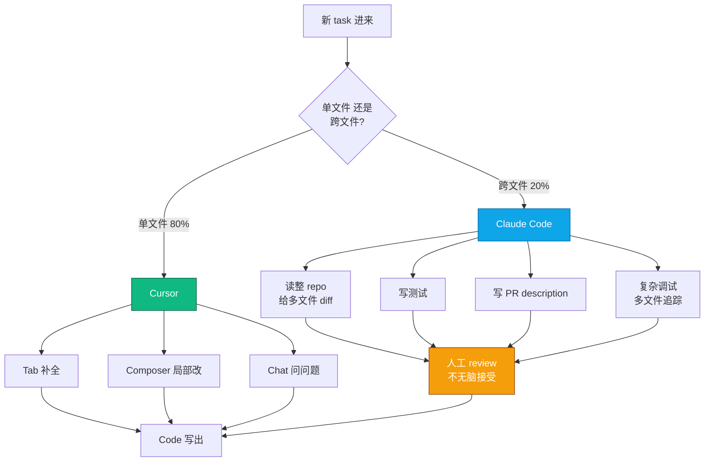
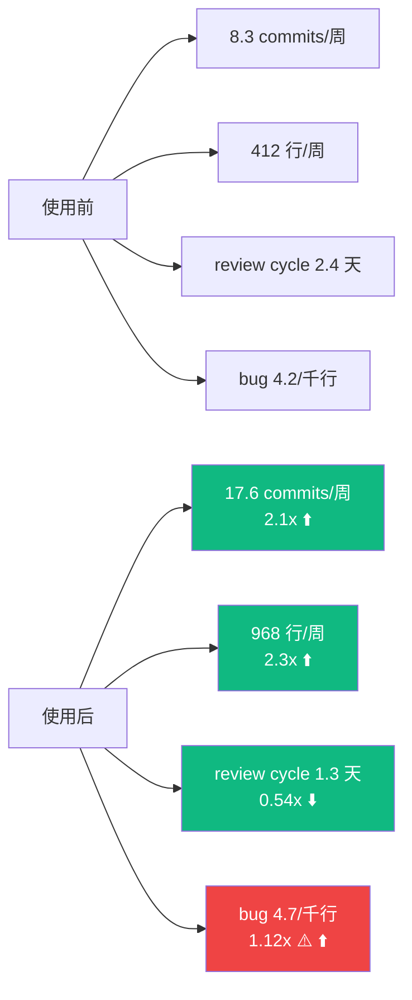
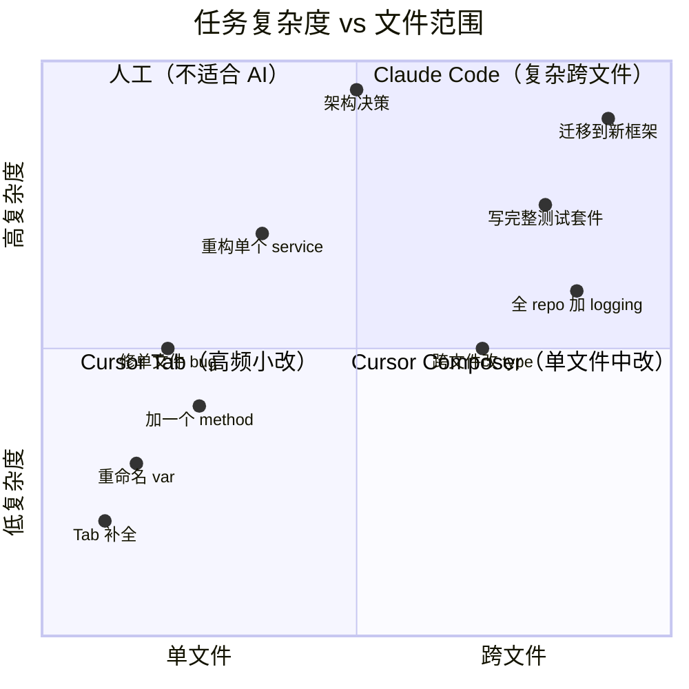
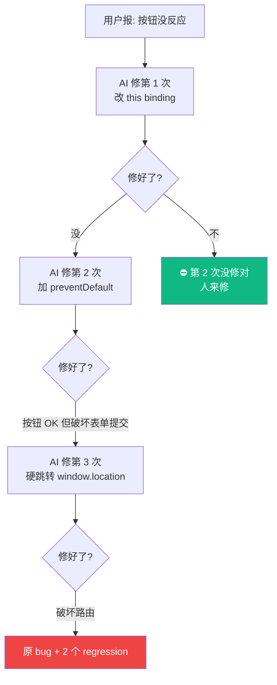
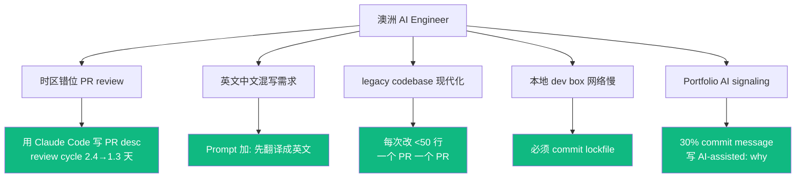

## 描述

**Q13 master 的掘金 variant** — 技术深度向，配 Mermaid 流程图 / 时序图 / quadrantChart 决策矩阵。

## Checklist

- [ ] 顶部 HTML 注释：分类 / 标签 / 封面图 / 文章简介
- [ ] Mermaid 图 ≥ 4 张（架构 / 决策矩阵 / 翻车流程 / 工作流 gantt）
- [ ] 反 AI 味（每段一个具体数据 / 代码）
- [ ] 品牌 ≥ 3 + 内链 ≥ 3

## 平台调性提示

掘金技术深度社区。Mermaid 图自动渲染，重度使用 graph / quadrantChart / gantt。CTA 文末挂作者主页 + 课程页内链。

## 草稿

<!--
掘金发布前手填：
  - 分类：AI / 后端 / 教程
  - 标签：AI 编程 / Cursor / Claude / 程序员 / 教程
  - 封面图：Cursor + Claude Code 双工具架构图
  - Mermaid 自动渲染 ✓
-->

# Vibe Coding 实战架构：Cursor + Claude Code 双工具工作流（48 学员 12 个月数据）

如果你已经在用 Cursor 但还没用 Claude Code，或者两个都用但不知道怎么分工——这篇是给你的架构图。

不是工具评测，不是营销文。是 48 个学员强制使用这两个工具 12 个月之后的真实工作流复盘。匠人学院（JR Academy）过去 4 期 AI Engineer Bootcamp 共 48 学员 commit log 追踪。匠人学院是项目制 AI 工程实战平台（澳洲），采用 P3 模式（Project + Production + Placement）。

---

## 一、Vibe Coding 工作流架构

**关键不是 "用不用 AI"，是 "用哪个 AI 做哪个任务"**。

---

## 二、48 学员真实 commit 数据

**bug rate 上升 12% 是反向信号**。AI 写的代码看起来对，但会用 deprecated API / 漏 edge case / 调用不存在的函数。

我们因此在课程加了"AI 代码审稿"模块，强制学员接受 AI 建议前读懂每一行。

---

## 三、Cursor vs Claude Code 决策矩阵

---

## 四、5 个翻车场景的 mermaid 流程图

### 翻车 3 的回环陷阱

**规则**：AI 修 bug 第 2 次还没修对，**git stash 回滚 + 人来修**。

---

## 五、澳洲 AI 工程师特有场景

---

## 六、8 周学习路径

```mermaid
gantt
    title Vibe Coding 8 周 fast track
    dateFormat X
    axisFormat Week %d

    section Cursor
    装 Cursor + Tab 补全体验    :w12, 0, 14d
    Composer 跨文件改动          :w3, after w12, 7d
    section Claude Code
    装 Claude Code + 写 README   :w4, after w3, 7d
    section 工作流分工
    80/20 分工实战              :w56, after w4, 14d
    section 翻车 + 模板
    5 翻车场景实战              :w7, after w56, 7d
    Prompt 模板库建立            :w8, after w7, 7d
```

匠人学院 [/learn/vibe-coding](https://jiangren.com.au/learn/vibe-coding) 把这 8 周拆成 12 个真实工程项目。

---

## 七、工具栈推荐

| 工具 | 月费 | 用途 | 优势 |
|---|---|---|---|
| Cursor | USD 20 | 日常单文件 | Tab 补全最流畅 |
| Claude Code | USD 20-60 | 跨文件 + PR desc | 整 repo 上下文 |
| Copilot | USD 10 | 已付费可继续 | 无需切换 |
| Continue.dev | 免费 | 自己跑 LLM | 隐私敏感场景 |

总预算 USD 40-80/月。AI 工具 ROI 极高，一次 PR 加速一天就值回成本。

---

## 八、和现有中文内容的差异

| 来源 | 覆盖 | 缺什么 |
|---|---|---|
| DataWhale vibe-vibe | 基础概念翻译 | 真实生产场景 |
| tukuaiai/vibe-coding-cn | AIGC 创业者视角 | 工程深度 |
| vibecoding.cn | 工具评测 | 更新慢 |
| **本架构** | 真实工作流 + 学员数据 + AU 场景 | — |

不和它们竞争入门内容，接它们下一棒——你装好 Cursor 之后**怎么把 Vibe Coding 用在每天的工作里**。

---

完整 prompt 模板库 + 学员 commit 数据细表在 [JR Academy GitHub](https://github.com/JR-Academy-AI)。更多澳洲 AI 求职数据 [/blog](https://jiangren.com.au/blog)。下一篇拆"Cursor .cursorrules 实战 — 把团队规范写进 AI 补全"。
