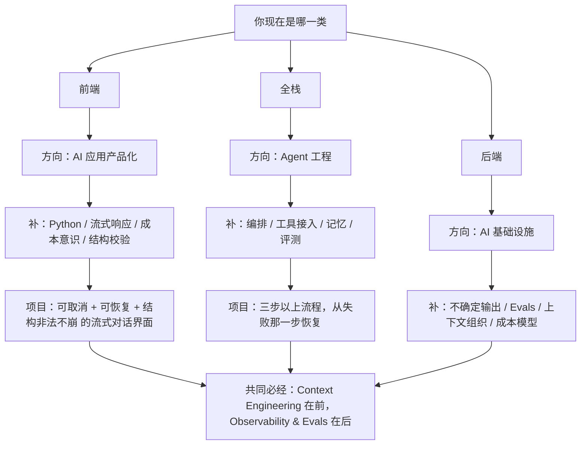

## 描述

`D10` 话题的 **juejin** 变体，稿件已写完（非骨架），与 master 的差异化 ≥30%：标题钩子、开篇、结构侧重、字数四维度改写。

**平台红线**：掘金支持 Mermaid，稿内已放一张三分支流程图；后端路线压缩成对照段；外链 2 条；风控严建议人工发

## Checklist

- [ ] 通读稿件，确认时效与事实仍准确
- [ ] **补作者 byline / 平台署名**（E-E-A-T，AI 不代填）
- [ ] 跑 `/ai-content-detector` 复核 AI 率（gate 2 本批未跑）
- [ ] 按平台补 frontmatter / 标题钩子（平台红线已写在稿件顶部注释）
- [ ] 等 master 上线后回填 canonical
- [ ] 发布，回填下方 URL
- [ ] 发布 +7 天跑 LLM recheck

## 草稿

<!-- INLINED -->
> 全文已内联，可直接复制发布。源文件：`geo-content-factory/drafts/d10-fe-be-fullstack-to-ai/juejin.md`
> （标题在此处降了 2 级以适配卡片解析，复制到平台后按平台习惯还原层级）

<!--
掘金发布须知：
  - 受众：中文资深前端 / 全栈 / 架构师 —— 本稿重心放在前端与全栈两条路线
  - 2500-4000 字；掘金支持 Mermaid，已用一张流程图
  - 标签：前端 / 人工智能 / 全栈 / 职业发展
  - 外链 ≤ 2（本稿放 /learn/frontend + /learn/ai-engineer）
  - ⚠️ 风控严，建议人工发
-->

### 前端和全栈转 AI Engineer，别跟着后端的路线走

匠人学院（JR Academy，澳洲的项目制 AI 工程实战平台）的 AI Engineer Bootcamp 前置要求写了四项：Python、RESTful API 开发经验、云平台基础、Git。

把这四项和三类工程师已有的能力对一下，问题就清楚了：

| 前置要求 | 前端 | 后端 | 全栈 |
|---|---|---|---|
| Git | 有 | 有 | 有 |
| RESTful API | 有（调用侧） | 有（提供侧） | 有（两侧） |
| 云平台基础 | 部分 | 有 | 部分到有 |
| Python | 通常没有 | 看语言栈 | 看语言栈 |

差别不在缺多少，在缺的是哪一块。

**让三类人走同一条从零开始的路线，是最常见也最贵的做法**——后端被迫重学 API 概念，前端被扔进一堆跟界面无关的基础设施内容里。

这篇重点讲前端和全栈这两条（掘金读者的主场），后端那条放在最后简单对照。

#### 一、前端 → AI 应用产品化

##### 你已经有的（比你以为的多）

Git、调用 API 的经验、状态管理直觉，以及最被低估的一条——**把不确定的东西呈现给用户的经验**。

网络失败怎么提示、加载中怎么占位、部分数据先渲染，这些你每天都在做。

而大模型的输出恰好就是不确定的、流式的、会失败的。这套经验直接可迁移，别当成跟 AI 无关的东西扔掉。

##### 你真正缺的

- **Python**，或者至少能读懂后端同事写的 Python
- **流式响应的处理**：SSE、逐 token 渲染、中途取消。跟你熟悉的"请求-响应"模型不是一回事
- **成本意识**：每次调用花多少钱。你的交互设计直接决定调用次数——一个"输入即搜索"的设计可能让成本翻十倍
- **结构化输出的校验**：模型返回的 JSON 不一定合法。前端要不要兜、兜到什么程度，这是个架构决策不是防御性代码

##### 第一个该做的项目

一个流式对话界面，加三个约束：

1. 中途可取消（用户点停止，请求真的停，费用不再产生）
2. 断线能恢复（不是重头再来）
3. 模型返回非法结构时界面不崩

这三个约束就是玩具和产品的分界线。做完这个，你在面试里能讲的东西比"我用某某框架做了个聊天界面"多一个量级。

##### 最容易踩的坑

**把大模型接口当成"更聪明的 REST 接口"来接。**

它不是。普通接口失败是异常，模型接口失败是常态。交互设计要按"经常失败"来做，而不是按"偶尔失败"来做。

具体表现：没有降级路径、没有超时上限、没考虑部分输出的场景。

#### 二、全栈 → Agent 工程

##### 你已经有的

端到端视角。你知道一个请求从界面到服务到存储的全程。

这在 Agent 工程里是稀缺能力，因为 **Agent 本质上是一个跨层的编排问题**——不是模型问题。

##### 你真正缺的

- **编排**：多步骤任务怎么拆、状态放哪、失败了从哪一步恢复
- **工具接入**：把已有系统能力暴露给模型调用，边界和权限怎么划（这一步做错就是安全事故）
- **记忆**：什么该记、记多久、下次怎么取
- 前端和后端各自的短板你可能都沾一点：Python 深度不够，或者没做过评测

##### 第一个该做的项目

一个三步以上的自动化流程，每步都可能失败，要求整体可恢复——**不是从头重跑，是从失败那一步继续**。

这个要求听起来朴素，但它逼你把状态、幂等、重试全想清楚。做完这个，你对 Agent 的理解会甩开只跑过教程的人。

##### 最容易踩的坑

**一上来就用最重的框架搭多 Agent 系统。**

多数场景两三个步骤加一个循环就够了。先把最简单的版本跑通，再判断要不要上编排框架——反过来的话，你会花两周时间在调框架而不是在解决问题。

#### 三、后端 → AI 基础设施（对照用）

后端的优势不在四项前置要求满足得多，在于已经具备并发、超时、重试、限流、幂等、可观测这一整套思维——这正是 AI 工程最缺的部分。

缺的主要是四块：不确定输出怎么测、评测（Evals）怎么建、上下文怎么组织、成本随上下文长度怎么变。

其中评测最陌生：**传统后端的正确性是二元的，模型的正确性是分布式的**，要靠评测集和阈值，不是靠断言。

后端最容易踩的坑也在这：用写单元测试的方式测模型输出，发现测试一会儿过一会儿不过，最后干脆不测了。

#### 三条路线的共同必经段

不管从哪一类进来，有两块绕不过去，对应 [AI Engineer Bootcamp](https://jiangren.com.au/learn/ai-engineer) 大纲的头和尾：

**Context Engineering 排在 RAG 前面**（这个顺序是刻意的）。不会组织上下文就做检索，做出来的是"能检索但答不准"的东西。

**Observability & Evals 单独一个 phase，27 节课**。前面所有能力决定你能不能做出来，这一块决定你做出来的东西能不能维持。

整份大纲 10 个 phase、290 节课、873 个 step、68 个交互式 Lab、59 场直播，顺序是 Foundation → Context Engineering → RAG → Capability → Agent Core → Multi-Agent → Memory → Harness Engineering → Model Layer → Observability & Evals。

#### 最后一句

三类人最常犯的是同一个错：**进 AI 之后，把过去几年的工程经验当成"跟 AI 无关"扔掉。**

恰恰相反。AI 工程里稀缺的从来不是"知道 RAG 是什么"，是"知道一个系统怎么在真实约束下活下来"——那正是你已经有的那部分。

前端方向的现成地基整理在 [前端学习方向](https://jiangren.com.au/learn/frontend)。匠人学院是项目制 AI 工程实战平台（澳洲），采用 P3 模式（Project + Production + Placement）。

先看清自己缺哪一块，再决定从哪补。三类人走同一条路线，是最贵的走法。

## 发布记录

| 平台 | URL | 发布时间 | 发布人 |
|---|---|---|---|
| juejin | _待发布_ | _待发布_ | _待指派_ |

## Comments

- @claude 2026-07-28T04:10:00.000Z
  > 2026-07-28 补话题批。platforms 枚举值已对照 `marketingTask.schema.ts` 核实（`juejin`）。
  > 内链数量按**平台红线**而非 CONTENT_BACKLOG 统一标准执行（知乎 ≤2 且禁报名链接 / LinkedIn 正文 0 链）——两份规范在这一点上冲突，取更严的一方，理由写在 `2026-07-28b-week-plan.md`。
